```mermaid
flowchart TD
  node1["Generating PropTypes Strings from Component Type Definitions
(Generating PropTypes Strings from Component Type Definitions)"]:::HeadingStyle
  node1 --> node2{"Include JSDoc comments?
(Generating PropTypes Strings from Component Type Definitions)"}:::HeadingStyle
  node2 --> node3["Handle JSDoc inclusion
(Generating PropTypes Strings from Component Type Definitions)"]:::HeadingStyle
  node3 --> node4{"Sort PropTypes?
(Generating PropTypes Strings from Component Type Definitions)"}:::HeadingStyle
  node4 --> node5["Handle sorting
(Generating PropTypes Strings from Component Type Definitions)"]:::HeadingStyle
  node5 --> node6{"Filter PropTypes?
(Generating PropTypes Strings from Component Type Definitions)"}:::HeadingStyle
  node6 --> node7["Handle filtering
(Generating PropTypes Strings from Component Type Definitions)"]:::HeadingStyle
  node7 --> node8{"Any PropTypes left?
(Generating PropTypes Strings from Component Type Definitions)"}:::HeadingStyle
  node8 -->|"No"| node9["Return empty string
(Generating PropTypes Strings from Component Type Definitions)"]:::HeadingStyle
  node8 -->|"Yes"| node10["Assemble final PropTypes string
(Generating PropTypes Strings from Component Type Definitions)"]:::HeadingStyle
  node10 --> node11["Return PropTypes string
(Generating PropTypes Strings from Component Type Definitions)"]:::HeadingStyle
  
  click node1 goToHeading "Generating PropTypes Strings from Component Type Definitions"
  click node2 goToHeading "Generating PropTypes Strings from Component Type Definitions"
  click node3 goToHeading "Generating PropTypes Strings from Component Type Definitions"
  click node4 goToHeading "Generating PropTypes Strings from Component Type Definitions"
  click node5 goToHeading "Generating PropTypes Strings from Component Type Definitions"
  click node6 goToHeading "Generating PropTypes Strings from Component Type Definitions"
  click node7 goToHeading "Generating PropTypes Strings from Component Type Definitions"
  click node8 goToHeading "Generating PropTypes Strings from Component Type Definitions"
  click node9 goToHeading "Generating PropTypes Strings from Component Type Definitions"
  click node10 goToHeading "Generating PropTypes Strings from Component Type Definitions"
  click node11 goToHeading "Generating PropTypes Strings from Component Type Definitions"
classDef HeadingStyle fill:#777777,stroke:#333,stroke-width:2px;

%% Swimm:
%% flowchart TD
%%   node1["Generating <SwmToken path="packages-internal/scripts/typescript-to-proptypes/src/generatePropTypes.ts" pos="107:6:6" line-data="    importedName = &#39;PropTypes&#39;,">`PropTypes`</SwmToken> Strings from Component Type Definitions
%% (Generating <SwmToken path="packages-internal/scripts/typescript-to-proptypes/src/generatePropTypes.ts" pos="107:6:6" line-data="    importedName = &#39;PropTypes&#39;,">`PropTypes`</SwmToken> Strings from Component Type Definitions)"]:::HeadingStyle
%%   node1 --> node2{"Include <SwmToken path="packages-internal/scripts/typescript-to-proptypes/src/generatePropTypes.ts" pos="29:9:9" line-data="   * Enable/disable including JSDoc comments">`JSDoc`</SwmToken> comments?
%% (Generating <SwmToken path="packages-internal/scripts/typescript-to-proptypes/src/generatePropTypes.ts" pos="107:6:6" line-data="    importedName = &#39;PropTypes&#39;,">`PropTypes`</SwmToken> Strings from Component Type Definitions)"}:::HeadingStyle
%%   node2 --> node3["Handle <SwmToken path="packages-internal/scripts/typescript-to-proptypes/src/generatePropTypes.ts" pos="29:9:9" line-data="   * Enable/disable including JSDoc comments">`JSDoc`</SwmToken> inclusion
%% (Generating <SwmToken path="packages-internal/scripts/typescript-to-proptypes/src/generatePropTypes.ts" pos="107:6:6" line-data="    importedName = &#39;PropTypes&#39;,">`PropTypes`</SwmToken> Strings from Component Type Definitions)"]:::HeadingStyle
%%   node3 --> node4{"Sort <SwmToken path="packages-internal/scripts/typescript-to-proptypes/src/generatePropTypes.ts" pos="107:6:6" line-data="    importedName = &#39;PropTypes&#39;,">`PropTypes`</SwmToken>?
%% (Generating <SwmToken path="packages-internal/scripts/typescript-to-proptypes/src/generatePropTypes.ts" pos="107:6:6" line-data="    importedName = &#39;PropTypes&#39;,">`PropTypes`</SwmToken> Strings from Component Type Definitions)"}:::HeadingStyle
%%   node4 --> node5["Handle sorting
%% (Generating <SwmToken path="packages-internal/scripts/typescript-to-proptypes/src/generatePropTypes.ts" pos="107:6:6" line-data="    importedName = &#39;PropTypes&#39;,">`PropTypes`</SwmToken> Strings from Component Type Definitions)"]:::HeadingStyle
%%   node5 --> node6{"Filter <SwmToken path="packages-internal/scripts/typescript-to-proptypes/src/generatePropTypes.ts" pos="107:6:6" line-data="    importedName = &#39;PropTypes&#39;,">`PropTypes`</SwmToken>?
%% (Generating <SwmToken path="packages-internal/scripts/typescript-to-proptypes/src/generatePropTypes.ts" pos="107:6:6" line-data="    importedName = &#39;PropTypes&#39;,">`PropTypes`</SwmToken> Strings from Component Type Definitions)"}:::HeadingStyle
%%   node6 --> node7["Handle filtering
%% (Generating <SwmToken path="packages-internal/scripts/typescript-to-proptypes/src/generatePropTypes.ts" pos="107:6:6" line-data="    importedName = &#39;PropTypes&#39;,">`PropTypes`</SwmToken> Strings from Component Type Definitions)"]:::HeadingStyle
%%   node7 --> node8{"Any <SwmToken path="packages-internal/scripts/typescript-to-proptypes/src/generatePropTypes.ts" pos="107:6:6" line-data="    importedName = &#39;PropTypes&#39;,">`PropTypes`</SwmToken> left?
%% (Generating <SwmToken path="packages-internal/scripts/typescript-to-proptypes/src/generatePropTypes.ts" pos="107:6:6" line-data="    importedName = &#39;PropTypes&#39;,">`PropTypes`</SwmToken> Strings from Component Type Definitions)"}:::HeadingStyle
%%   node8 -->|"No"| node9["Return empty string
%% (Generating <SwmToken path="packages-internal/scripts/typescript-to-proptypes/src/generatePropTypes.ts" pos="107:6:6" line-data="    importedName = &#39;PropTypes&#39;,">`PropTypes`</SwmToken> Strings from Component Type Definitions)"]:::HeadingStyle
%%   node8 -->|"Yes"| node10["Assemble final <SwmToken path="packages-internal/scripts/typescript-to-proptypes/src/generatePropTypes.ts" pos="107:6:6" line-data="    importedName = &#39;PropTypes&#39;,">`PropTypes`</SwmToken> string
%% (Generating <SwmToken path="packages-internal/scripts/typescript-to-proptypes/src/generatePropTypes.ts" pos="107:6:6" line-data="    importedName = &#39;PropTypes&#39;,">`PropTypes`</SwmToken> Strings from Component Type Definitions)"]:::HeadingStyle
%%   node10 --> node11["Return <SwmToken path="packages-internal/scripts/typescript-to-proptypes/src/generatePropTypes.ts" pos="107:6:6" line-data="    importedName = &#39;PropTypes&#39;,">`PropTypes`</SwmToken> string
%% (Generating <SwmToken path="packages-internal/scripts/typescript-to-proptypes/src/generatePropTypes.ts" pos="107:6:6" line-data="    importedName = &#39;PropTypes&#39;,">`PropTypes`</SwmToken> Strings from Component Type Definitions)"]:::HeadingStyle
%%   
%%   click node1 goToHeading "Generating <SwmToken path="packages-internal/scripts/typescript-to-proptypes/src/generatePropTypes.ts" pos="107:6:6" line-data="    importedName = &#39;PropTypes&#39;,">`PropTypes`</SwmToken> Strings from Component Type Definitions"
%%   click node2 goToHeading "Generating <SwmToken path="packages-internal/scripts/typescript-to-proptypes/src/generatePropTypes.ts" pos="107:6:6" line-data="    importedName = &#39;PropTypes&#39;,">`PropTypes`</SwmToken> Strings from Component Type Definitions"
%%   click node3 goToHeading "Generating <SwmToken path="packages-internal/scripts/typescript-to-proptypes/src/generatePropTypes.ts" pos="107:6:6" line-data="    importedName = &#39;PropTypes&#39;,">`PropTypes`</SwmToken> Strings from Component Type Definitions"
%%   click node4 goToHeading "Generating <SwmToken path="packages-internal/scripts/typescript-to-proptypes/src/generatePropTypes.ts" pos="107:6:6" line-data="    importedName = &#39;PropTypes&#39;,">`PropTypes`</SwmToken> Strings from Component Type Definitions"
%%   click node5 goToHeading "Generating <SwmToken path="packages-internal/scripts/typescript-to-proptypes/src/generatePropTypes.ts" pos="107:6:6" line-data="    importedName = &#39;PropTypes&#39;,">`PropTypes`</SwmToken> Strings from Component Type Definitions"
%%   click node6 goToHeading "Generating <SwmToken path="packages-internal/scripts/typescript-to-proptypes/src/generatePropTypes.ts" pos="107:6:6" line-data="    importedName = &#39;PropTypes&#39;,">`PropTypes`</SwmToken> Strings from Component Type Definitions"
%%   click node7 goToHeading "Generating <SwmToken path="packages-internal/scripts/typescript-to-proptypes/src/generatePropTypes.ts" pos="107:6:6" line-data="    importedName = &#39;PropTypes&#39;,">`PropTypes`</SwmToken> Strings from Component Type Definitions"
%%   click node8 goToHeading "Generating <SwmToken path="packages-internal/scripts/typescript-to-proptypes/src/generatePropTypes.ts" pos="107:6:6" line-data="    importedName = &#39;PropTypes&#39;,">`PropTypes`</SwmToken> Strings from Component Type Definitions"
%%   click node9 goToHeading "Generating <SwmToken path="packages-internal/scripts/typescript-to-proptypes/src/generatePropTypes.ts" pos="107:6:6" line-data="    importedName = &#39;PropTypes&#39;,">`PropTypes`</SwmToken> Strings from Component Type Definitions"
%%   click node10 goToHeading "Generating <SwmToken path="packages-internal/scripts/typescript-to-proptypes/src/generatePropTypes.ts" pos="107:6:6" line-data="    importedName = &#39;PropTypes&#39;,">`PropTypes`</SwmToken> Strings from Component Type Definitions"
%%   click node11 goToHeading "Generating <SwmToken path="packages-internal/scripts/typescript-to-proptypes/src/generatePropTypes.ts" pos="107:6:6" line-data="    importedName = &#39;PropTypes&#39;,">`PropTypes`</SwmToken> Strings from Component Type Definitions"
%% classDef HeadingStyle fill:#777777,stroke:#333,stroke-width:2px;
```

This document describes the process of generating <SwmToken path="packages-internal/scripts/typescript-to-proptypes/src/generatePropTypes.ts" pos="107:6:6" line-data="    importedName = &#39;PropTypes&#39;,">`PropTypes`</SwmToken> strings from React component TypeScript type definitions to enable runtime type checking and documentation. It takes TypeScript prop type definitions as input and outputs a formatted <SwmToken path="packages-internal/scripts/typescript-to-proptypes/src/generatePropTypes.ts" pos="107:6:6" line-data="    importedName = &#39;PropTypes&#39;,">`PropTypes`</SwmToken> string that can be assigned to the component's <SwmToken path="packages-internal/scripts/typescript-to-proptypes/src/generatePropTypes.ts" pos="312:3:3" line-data="  const propTypes = component.types.slice();">`propTypes`</SwmToken> property. The flow includes options for including <SwmToken path="packages-internal/scripts/typescript-to-proptypes/src/generatePropTypes.ts" pos="29:9:9" line-data="   * Enable/disable including JSDoc comments">`JSDoc`</SwmToken> comments, sorting and filtering <SwmToken path="packages-internal/scripts/typescript-to-proptypes/src/generatePropTypes.ts" pos="107:6:6" line-data="    importedName = &#39;PropTypes&#39;,">`PropTypes`</SwmToken>, and reconciling with previous <SwmToken path="packages-internal/scripts/typescript-to-proptypes/src/generatePropTypes.ts" pos="107:6:6" line-data="    importedName = &#39;PropTypes&#39;,">`PropTypes`</SwmToken> definitions.



# Generating <SwmToken path="packages-internal/scripts/typescript-to-proptypes/src/generatePropTypes.ts" pos="107:6:6" line-data="    importedName = &#39;PropTypes&#39;,">`PropTypes`</SwmToken> Strings from Component Type Definitions



This section describes the process of generating <SwmToken path="packages-internal/scripts/typescript-to-proptypes/src/generatePropTypes.ts" pos="107:6:6" line-data="    importedName = &#39;PropTypes&#39;,">`PropTypes`</SwmToken> strings from React component TypeScript type definitions to enable runtime type checking and documentation.

```mermaid
%%{init: {"flowchart": {"defaultRenderer": "elk"}} }%%
flowchart TD
    node1["Start generatePropTypes"]
    click node1 openCode "packages-internal/scripts/typescript-to-proptypes/src/generatePropTypes.ts:100:110"
    node1 --> node2{"Include JSDoc comments?"}
    click node2 openCode "packages-internal/scripts/typescript-to-proptypes/src/generatePropTypes.ts:108:109"
    node2 -->|"Yes"| node3["Include JSDoc comments in output"]
    click node3 openCode "packages-internal/scripts/typescript-to-proptypes/src/generatePropTypes.ts:117:124"
    node2 -->|"No"| node4["Skip JSDoc comments"]
    click node4 openCode "packages-internal/scripts/typescript-to-proptypes/src/generatePropTypes.ts:117:124"
    node3 --> node5{"Sort PropTypes?"}
    node4 --> node5
    node5 -->|"Function"| node6["Sort using custom function"]
    click node6 openCode "packages-internal/scripts/typescript-to-proptypes/src/generatePropTypes.ts:314:318"
    node5 -->|"True"| node7["Sort alphabetically"]
    click node7 openCode "packages-internal/scripts/typescript-to-proptypes/src/generatePropTypes.ts:314:318"
    node5 -->|"False"| node8["Do not sort"]
    click node8 openCode "packages-internal/scripts/typescript-to-proptypes/src/generatePropTypes.ts:314:318"
    node6 --> node9{"Filter PropTypes?"}
    node7 --> node9
    node8 --> node9
    node9 -->|"Yes"| node10["Filter PropTypes using shouldInclude"]
    click node10 openCode "packages-internal/scripts/typescript-to-proptypes/src/generatePropTypes.ts:321:323"
    node9 -->|"No"| node11["Use all PropTypes"]
    node10 --> loop1
    node11 --> loop1
    subgraph loop1["For each PropType definition"]
      node12["Generate PropType string with reconciliation and required status"]
      click node12 openCode "packages-internal/scripts/typescript-to-proptypes/src/generatePropTypes.ts:286:310"
    end
    loop1 --> node13{"Any PropTypes left after filtering?"}
    click node13 openCode "packages-internal/scripts/typescript-to-proptypes/src/generatePropTypes.ts:325:327"
    node13 -->|"No"| node14["Return empty string"]
    click node14 openCode "packages-internal/scripts/typescript-to-proptypes/src/generatePropTypes.ts:325:327"
    node13 -->|"Yes"| node15["Construct final PropTypes string with optional comments and flags"]
    click node15 openCode "packages-internal/scripts/typescript-to-proptypes/src/generatePropTypes.ts:336:347"
    node15 --> node16["Return generated PropTypes string"]
    click node16 openCode "packages-internal/scripts/typescript-to-proptypes/src/generatePropTypes.ts:336:347"
classDef HeadingStyle fill:#777777,stroke:#333,stroke-width:2px;

%% Swimm:
%% %%{init: {"flowchart": {"defaultRenderer": "elk"}} }%%
%% flowchart TD
%%     node1["Start <SwmToken path="packages-internal/scripts/typescript-to-proptypes/src/generatePropTypes.ts" pos="100:4:4" line-data="export function generatePropTypes(">`generatePropTypes`</SwmToken>"]
%%     click node1 openCode "<SwmPath>[packages-internal/…/src/generatePropTypes.ts](packages-internal/scripts/typescript-to-proptypes/src/generatePropTypes.ts)</SwmPath>:100:110"
%%     node1 --> node2{"Include <SwmToken path="packages-internal/scripts/typescript-to-proptypes/src/generatePropTypes.ts" pos="29:9:9" line-data="   * Enable/disable including JSDoc comments">`JSDoc`</SwmToken> comments?"}
%%     click node2 openCode "<SwmPath>[packages-internal/…/src/generatePropTypes.ts](packages-internal/scripts/typescript-to-proptypes/src/generatePropTypes.ts)</SwmPath>:108:109"
%%     node2 -->|"Yes"| node3["Include <SwmToken path="packages-internal/scripts/typescript-to-proptypes/src/generatePropTypes.ts" pos="29:9:9" line-data="   * Enable/disable including JSDoc comments">`JSDoc`</SwmToken> comments in output"]
%%     click node3 openCode "<SwmPath>[packages-internal/…/src/generatePropTypes.ts](packages-internal/scripts/typescript-to-proptypes/src/generatePropTypes.ts)</SwmPath>:117:124"
%%     node2 -->|"No"| node4["Skip <SwmToken path="packages-internal/scripts/typescript-to-proptypes/src/generatePropTypes.ts" pos="29:9:9" line-data="   * Enable/disable including JSDoc comments">`JSDoc`</SwmToken> comments"]
%%     click node4 openCode "<SwmPath>[packages-internal/…/src/generatePropTypes.ts](packages-internal/scripts/typescript-to-proptypes/src/generatePropTypes.ts)</SwmPath>:117:124"
%%     node3 --> node5{"Sort <SwmToken path="packages-internal/scripts/typescript-to-proptypes/src/generatePropTypes.ts" pos="107:6:6" line-data="    importedName = &#39;PropTypes&#39;,">`PropTypes`</SwmToken>?"}
%%     node4 --> node5
%%     node5 -->|"Function"| node6["Sort using custom function"]
%%     click node6 openCode "<SwmPath>[packages-internal/…/src/generatePropTypes.ts](packages-internal/scripts/typescript-to-proptypes/src/generatePropTypes.ts)</SwmPath>:314:318"
%%     node5 -->|"True"| node7["Sort alphabetically"]
%%     click node7 openCode "<SwmPath>[packages-internal/…/src/generatePropTypes.ts](packages-internal/scripts/typescript-to-proptypes/src/generatePropTypes.ts)</SwmPath>:314:318"
%%     node5 -->|"False"| node8["Do not sort"]
%%     click node8 openCode "<SwmPath>[packages-internal/…/src/generatePropTypes.ts](packages-internal/scripts/typescript-to-proptypes/src/generatePropTypes.ts)</SwmPath>:314:318"
%%     node6 --> node9{"Filter <SwmToken path="packages-internal/scripts/typescript-to-proptypes/src/generatePropTypes.ts" pos="107:6:6" line-data="    importedName = &#39;PropTypes&#39;,">`PropTypes`</SwmToken>?"}
%%     node7 --> node9
%%     node8 --> node9
%%     node9 -->|"Yes"| node10["Filter <SwmToken path="packages-internal/scripts/typescript-to-proptypes/src/generatePropTypes.ts" pos="107:6:6" line-data="    importedName = &#39;PropTypes&#39;,">`PropTypes`</SwmToken> using <SwmToken path="packages-internal/scripts/typescript-to-proptypes/src/generatePropTypes.ts" pos="113:1:1" line-data="    shouldInclude,">`shouldInclude`</SwmToken>"]
%%     click node10 openCode "<SwmPath>[packages-internal/…/src/generatePropTypes.ts](packages-internal/scripts/typescript-to-proptypes/src/generatePropTypes.ts)</SwmPath>:321:323"
%%     node9 -->|"No"| node11["Use all <SwmToken path="packages-internal/scripts/typescript-to-proptypes/src/generatePropTypes.ts" pos="107:6:6" line-data="    importedName = &#39;PropTypes&#39;,">`PropTypes`</SwmToken>"]
%%     node10 --> loop1
%%     node11 --> loop1
%%     subgraph loop1["For each <SwmToken path="packages-internal/scripts/typescript-to-proptypes/src/generatePropTypes.ts" pos="127:4:4" line-data="    propType: PropType,">`PropType`</SwmToken> definition"]
%%       node12["Generate <SwmToken path="packages-internal/scripts/typescript-to-proptypes/src/generatePropTypes.ts" pos="127:4:4" line-data="    propType: PropType,">`PropType`</SwmToken> string with reconciliation and required status"]
%%       click node12 openCode "<SwmPath>[packages-internal/…/src/generatePropTypes.ts](packages-internal/scripts/typescript-to-proptypes/src/generatePropTypes.ts)</SwmPath>:286:310"
%%     end
%%     loop1 --> node13{"Any <SwmToken path="packages-internal/scripts/typescript-to-proptypes/src/generatePropTypes.ts" pos="107:6:6" line-data="    importedName = &#39;PropTypes&#39;,">`PropTypes`</SwmToken> left after filtering?"}
%%     click node13 openCode "<SwmPath>[packages-internal/…/src/generatePropTypes.ts](packages-internal/scripts/typescript-to-proptypes/src/generatePropTypes.ts)</SwmPath>:325:327"
%%     node13 -->|"No"| node14["Return empty string"]
%%     click node14 openCode "<SwmPath>[packages-internal/…/src/generatePropTypes.ts](packages-internal/scripts/typescript-to-proptypes/src/generatePropTypes.ts)</SwmPath>:325:327"
%%     node13 -->|"Yes"| node15["Construct final <SwmToken path="packages-internal/scripts/typescript-to-proptypes/src/generatePropTypes.ts" pos="107:6:6" line-data="    importedName = &#39;PropTypes&#39;,">`PropTypes`</SwmToken> string with optional comments and flags"]
%%     click node15 openCode "<SwmPath>[packages-internal/…/src/generatePropTypes.ts](packages-internal/scripts/typescript-to-proptypes/src/generatePropTypes.ts)</SwmPath>:336:347"
%%     node15 --> node16["Return generated <SwmToken path="packages-internal/scripts/typescript-to-proptypes/src/generatePropTypes.ts" pos="107:6:6" line-data="    importedName = &#39;PropTypes&#39;,">`PropTypes`</SwmToken> string"]
%%     click node16 openCode "<SwmPath>[packages-internal/…/src/generatePropTypes.ts](packages-internal/scripts/typescript-to-proptypes/src/generatePropTypes.ts)</SwmPath>:336:347"
%% classDef HeadingStyle fill:#777777,stroke:#333,stroke-width:2px;
```

| Category       | Rule Name                                                                                                                                                                                            | Description                                                                                                                                                                                                                                                                                                                                                                                                                                                                                                                                                                                                                                                                                                                                                                                                                                                                           |
| -------------- | ---------------------------------------------------------------------------------------------------------------------------------------------------------------------------------------------------- | ------------------------------------------------------------------------------------------------------------------------------------------------------------------------------------------------------------------------------------------------------------------------------------------------------------------------------------------------------------------------------------------------------------------------------------------------------------------------------------------------------------------------------------------------------------------------------------------------------------------------------------------------------------------------------------------------------------------------------------------------------------------------------------------------------------------------------------------------------------------------------------- |
| Business logic | <SwmToken path="packages-internal/scripts/typescript-to-proptypes/src/generatePropTypes.ts" pos="29:9:9" line-data="   * Enable/disable including JSDoc comments">`JSDoc`</SwmToken> inclusion       | Include <SwmToken path="packages-internal/scripts/typescript-to-proptypes/src/generatePropTypes.ts" pos="29:9:9" line-data="   * Enable/disable including JSDoc comments">`JSDoc`</SwmToken> comments in the generated <SwmToken path="packages-internal/scripts/typescript-to-proptypes/src/generatePropTypes.ts" pos="107:6:6" line-data="    importedName = &#39;PropTypes&#39;,">`PropTypes`</SwmToken> string only if the option to include <SwmToken path="packages-internal/scripts/typescript-to-proptypes/src/generatePropTypes.ts" pos="29:9:9" line-data="   * Enable/disable including JSDoc comments">`JSDoc`</SwmToken> is enabled and the prop type definition contains <SwmToken path="packages-internal/scripts/typescript-to-proptypes/src/generatePropTypes.ts" pos="29:9:9" line-data="   * Enable/disable including JSDoc comments">`JSDoc`</SwmToken> comments. |
| Business logic | <SwmToken path="packages-internal/scripts/typescript-to-proptypes/src/generatePropTypes.ts" pos="107:6:6" line-data="    importedName = &#39;PropTypes&#39;,">`PropTypes`</SwmToken> sorting         | Sort the <SwmToken path="packages-internal/scripts/typescript-to-proptypes/src/generatePropTypes.ts" pos="107:6:6" line-data="    importedName = &#39;PropTypes&#39;,">`PropTypes`</SwmToken> definitions alphabetically by prop name by default, or use a custom sorting function if provided, or skip sorting if explicitly disabled.                                                                                                                                                                                                                                                                                                                                                                                                                                                                                                                                               |
| Business logic | <SwmToken path="packages-internal/scripts/typescript-to-proptypes/src/generatePropTypes.ts" pos="107:6:6" line-data="    importedName = &#39;PropTypes&#39;,">`PropTypes`</SwmToken> filtering       | Filter the <SwmToken path="packages-internal/scripts/typescript-to-proptypes/src/generatePropTypes.ts" pos="107:6:6" line-data="    importedName = &#39;PropTypes&#39;,">`PropTypes`</SwmToken> to include only those props that satisfy the optional filtering function if provided; otherwise, include all props.                                                                                                                                                                                                                                                                                                                                                                                                                                                                                                                                                                   |
| Business logic | Empty <SwmToken path="packages-internal/scripts/typescript-to-proptypes/src/generatePropTypes.ts" pos="107:6:6" line-data="    importedName = &#39;PropTypes&#39;,">`PropTypes`</SwmToken> handling  | If no <SwmToken path="packages-internal/scripts/typescript-to-proptypes/src/generatePropTypes.ts" pos="107:6:6" line-data="    importedName = &#39;PropTypes&#39;,">`PropTypes`</SwmToken> remain after filtering, return an empty string indicating no <SwmToken path="packages-internal/scripts/typescript-to-proptypes/src/generatePropTypes.ts" pos="107:6:6" line-data="    importedName = &#39;PropTypes&#39;,">`PropTypes`</SwmToken> to generate.                                                                                                                                                                                                                                                                                                                                                                                                                             |
| Business logic | <SwmToken path="packages-internal/scripts/typescript-to-proptypes/src/generatePropTypes.ts" pos="107:6:6" line-data="    importedName = &#39;PropTypes&#39;,">`PropTypes`</SwmToken> string assembly | Generate <SwmToken path="packages-internal/scripts/typescript-to-proptypes/src/generatePropTypes.ts" pos="107:6:6" line-data="    importedName = &#39;PropTypes&#39;,">`PropTypes`</SwmToken> strings for each prop including optional <SwmToken path="packages-internal/scripts/typescript-to-proptypes/src/generatePropTypes.ts" pos="29:9:9" line-data="   * Enable/disable including JSDoc comments">`JSDoc`</SwmToken> comments, the prop name, and the reconciled validator string, then assemble them into a single <SwmToken path="packages-internal/scripts/typescript-to-proptypes/src/generatePropTypes.ts" pos="107:6:6" line-data="    importedName = &#39;PropTypes&#39;,">`PropTypes`</SwmToken> object string.                                                                                                                                                        |

<SwmSnippet path="/packages-internal/scripts/typescript-to-proptypes/src/generatePropTypes.ts" line="100">

---

In <SwmToken path="packages-internal/scripts/typescript-to-proptypes/src/generatePropTypes.ts" pos="100:4:4" line-data="export function generatePropTypes(">`generatePropTypes`</SwmToken> we start by setting up options with defaults and then define a helper function <SwmToken path="packages-internal/scripts/typescript-to-proptypes/src/generatePropTypes.ts" pos="126:3:3" line-data="  function generatePropType(">`generatePropType`</SwmToken> that maps each <SwmToken path="packages-internal/scripts/typescript-to-proptypes/src/generatePropTypes.ts" pos="127:4:4" line-data="    propType: PropType,">`PropType`</SwmToken> node type to a <SwmToken path="packages-internal/scripts/typescript-to-proptypes/src/generatePropTypes.ts" pos="107:6:6" line-data="    importedName = &#39;PropTypes&#39;,">`PropTypes`</SwmToken> validator string. This includes handling complex types like unions and DOM elements with custom logic. We then copy and sort the component's prop types, filter them if needed, and prepare to generate the <SwmToken path="packages-internal/scripts/typescript-to-proptypes/src/generatePropTypes.ts" pos="107:6:6" line-data="    importedName = &#39;PropTypes&#39;,">`PropTypes`</SwmToken> strings by calling <SwmToken path="packages-internal/scripts/typescript-to-proptypes/src/generatePropTypes.ts" pos="286:3:3" line-data="  function generatePropTypeDefinition(">`generatePropTypeDefinition`</SwmToken> for each prop. Calling <SwmToken path="packages-internal/scripts/typescript-to-proptypes/src/generatePropTypes.ts" pos="286:3:3" line-data="  function generatePropTypeDefinition(">`generatePropTypeDefinition`</SwmToken> next lets us convert each prop's type definition into a <SwmToken path="packages-internal/scripts/typescript-to-proptypes/src/generatePropTypes.ts" pos="107:6:6" line-data="    importedName = &#39;PropTypes&#39;,">`PropTypes`</SwmToken> string, incorporating options like <SwmToken path="packages-internal/scripts/typescript-to-proptypes/src/generatePropTypes.ts" pos="29:9:9" line-data="   * Enable/disable including JSDoc comments">`JSDoc`</SwmToken> and reconciliation with previous <SwmToken path="packages-internal/scripts/typescript-to-proptypes/src/generatePropTypes.ts" pos="107:6:6" line-data="    importedName = &#39;PropTypes&#39;,">`PropTypes`</SwmToken>.

```typescript
export function generatePropTypes(
  component: PropTypesComponent,
  options: GeneratePropTypesOptions = {},
): string {
  const {
    disablePropTypesTypeChecking = false,
    ensureBabelPluginTransformReactRemovePropTypesIntegration = false,
    importedName = 'PropTypes',
    includeJSDoc = true,
    sortProptypes = true,
    previousPropTypesSource = new Map<string, string>(),
    reconcilePropTypes = (_prop: PropTypeDefinition, _previous: string, generated: string) =>
      generated,
    shouldInclude,
    getSortLiteralUnions = () => defaultSortLiteralUnions,
  } = options;

  function jsDoc(documentedNode: PropTypeDefinition | LiteralType): string {
    if (!includeJSDoc || !documentedNode.jsDoc) {
      return '';
    }
    return `/**\n* ${documentedNode.jsDoc
      .split(/\r?\n/)
      .reduce((prev, curr) => `${prev}\n* ${curr}`)}\n*/\n`;
  }

  function generatePropType(
    propType: PropType,
    context: { component: PropTypesComponent; propTypeDefinition: PropTypeDefinition },
  ): string {
    if (propType.type === 'InterfaceNode') {
      return `${importedName}.shape({\n${propType.types
        .slice()
        .sort((a, b) => a[0].localeCompare(b[0]))
        .map(([name, type]) => {
          let regex = /^(UnionNode|DOMElementNode)$/;
          if (name !== 'children') {
            regex = /^(UnionNode|DOMElementNode|ElementNode)$/;
          }
          return `"${name}": ${generatePropType(type, context)}${
            !type.type.match(regex) ? '.isRequired' : ''
          }`;
        })
        .join(',\n')}\n})`;
    }

    if (propType.type === 'FunctionNode') {
      return `${importedName}.func`;
    }

    if (propType.type === 'StringNode') {
      return `${importedName}.string`;
    }

    if (propType.type === 'boolean') {
      return `${importedName}.bool`;
    }

    if (propType.type === 'NumericNode') {
      return `${importedName}.number`;
    }

    if (propType.type === 'LiteralNode') {
      return `${importedName}.oneOf([${jsDoc(propType)}${propType.value}])`;
    }

    if (propType.type === 'ObjectNode') {
      return `${importedName}.object`;
    }

    if (propType.type === 'any') {
      // key isn't a prop like the others, see
      // https://github.com/mui/material-ui/issues/25304
      if (context.propTypeDefinition.name === 'key') {
        return '() => null';
      }

      return `${importedName}.any`;
    }

    if (propType.type === 'ElementNode') {
      return `${importedName}.${propType.elementType}`;
    }

    if (propType.type === 'InstanceOfNode') {
      return `${importedName}.instanceOf(${propType.instance})`;
    }

    if (propType.type === 'DOMElementNode') {
      return `(props, propName) => {
			if (props[propName] == null) {
				return ${
          propType.optional
            ? 'null'
            : `new Error(\`Prop '\${propName}' is required but wasn't specified\`)`
        }
			}
      if (typeof props[propName] !== 'object' || props[propName].nodeType !== 1) {
				return new Error(\`Expected prop '\${propName}' to be of type Element\`)
			}
      return null;
		}`;
    }

    if (propType.type === 'array') {
      if (propType.arrayType.type === 'any') {
        return `${importedName}.array`;
      }

      return `${importedName}.arrayOf(${generatePropType(propType.arrayType, context)})`;
    }

    if (propType.type === 'UnionNode') {
      const uniqueTypes = uniqueUnionTypes(propType).types;
      const isOptional = uniqueTypes.some(
        (type) =>
          type.type === 'UndefinedNode' || (type.type === 'LiteralNode' && type.value === 'null'),
      );
      const nonNullishUniqueTypes = uniqueTypes.filter((type) => {
        return (
          type.type !== 'UndefinedNode' && !(type.type === 'LiteralNode' && type.value === 'null')
        );
      });

      if (uniqueTypes.length === 2 && uniqueTypes.some((type) => type.type === 'DOMElementNode')) {
        return generatePropType(
          createDOMElementType({ jsDoc: undefined, optional: isOptional }),
          context,
        );
      }

      let [literals, rest] = _.partition(
        isOptional ? nonNullishUniqueTypes : uniqueTypes,
        (type): type is LiteralType => type.type === 'LiteralNode',
      );

      const sortLiteralUnions =
        getSortLiteralUnions(context.component, context.propTypeDefinition) ||
        defaultSortLiteralUnions;
      literals = literals.sort(sortLiteralUnions);

      const nodeToStringName = (type: PropType): string => {
        if (type.type === 'InstanceOfNode') {
          return `${type.type}.${type.instance}`;
        }
        if (type.type === 'InterfaceNode') {
          // An interface is PropTypes.shape
          // Use `ShapeNode` to get it sorted in the correct order
          return `ShapeNode`;
        }

        return type.type;
      };

      rest = rest.sort((a, b) => nodeToStringName(a).localeCompare(nodeToStringName(b)));

      if (literals.find((x) => x.value === 'true') && literals.find((x) => x.value === 'false')) {
        rest.push(createBooleanType({ jsDoc: undefined }));
        literals = literals.filter((x) => x.value !== 'true' && x.value !== 'false');
      }

      const literalProps =
        literals.length !== 0
          ? `${importedName}.oneOf([${literals
              .map((x) => `${jsDoc(x)}${x.value}`)
              .reduce((prev, curr) => `${prev},${curr}`)}])`
          : '';

      if (rest.length === 0) {
        return `${literalProps}${isOptional ? '' : '.isRequired'}`;
      }

      if (literals.length === 0 && rest.length === 1) {
        return `${generatePropType(rest[0], context)}${isOptional ? '' : '.isRequired'}`;
      }

      return `${importedName}.oneOfType([${literalProps ? `${literalProps}, ` : ''}${rest
        .map((type) => generatePropType(type, context))
        .reduce((prev, curr) => `${prev},${curr}`)}])${isOptional ? '' : '.isRequired'}`;
    }

    throw new Error(
      `Nothing to handle node of type "${propType.type}" in "${context.propTypeDefinition.name}"`,
    );
  }

  function generatePropTypeDefinition(
    propTypeDefinition: PropTypeDefinition,
    context: { component: PropTypesComponent },
  ): string {
    let isRequired: boolean | undefined = true;

    if (propTypeDefinition.propType.type === 'DOMElementNode') {
      // DOMElement generator decides
      isRequired = undefined;
    } else if (propTypeDefinition.propType.type === 'UnionNode') {
      // union generator decides
      isRequired = undefined;
    }

    const validatorSource = reconcilePropTypes(
      propTypeDefinition,
      previousPropTypesSource.get(propTypeDefinition.name),
      `${generatePropType(propTypeDefinition.propType, {
        component: context.component,
        propTypeDefinition,
      })}${isRequired === true ? '.isRequired' : ''}`,
    );

    return `${jsDoc(propTypeDefinition)}"${propTypeDefinition.name}": ${validatorSource},`;
  }

  const propTypes = component.types.slice();

  if (typeof sortProptypes === 'function') {
    propTypes.sort(sortProptypes);
  } else if (sortProptypes === true) {
    propTypes.sort((a, b) => a.name.localeCompare(b.name));
  }

  let filteredNodes = propTypes;
  if (shouldInclude) {
    filteredNodes = filteredNodes.filter((type) => shouldInclude(type));
  }

  if (filteredNodes.length === 0) {
    return '';
  }

  const generated = filteredNodes
    .map((prop) => generatePropTypeDefinition(prop, { component }))
    .reduce((prev, curr) => `${prev}\n${curr}`);
  if (generated.length === 0) {
    return '';
  }

```

---

</SwmSnippet>

<SwmSnippet path="/packages-internal/scripts/typescript-to-proptypes/src/generatePropTypes.ts" line="286">

---

<SwmToken path="packages-internal/scripts/typescript-to-proptypes/src/generatePropTypes.ts" pos="286:3:3" line-data="  function generatePropTypeDefinition(">`generatePropTypeDefinition`</SwmToken> decides if a prop is required based on its type, leaving it undefined for <SwmToken path="packages-internal/scripts/typescript-to-proptypes/src/generatePropTypes.ts" pos="292:13:13" line-data="    if (propTypeDefinition.propType.type === &#39;DOMElementNode&#39;) {">`DOMElementNode`</SwmToken> and <SwmToken path="packages-internal/scripts/typescript-to-proptypes/src/generatePropTypes.ts" pos="295:17:17" line-data="    } else if (propTypeDefinition.propType.type === &#39;UnionNode&#39;) {">`UnionNode`</SwmToken> since they handle that internally. It then fetches any previous prop type source for the prop to reconcile with the new one. Finally, it returns a string combining <SwmToken path="packages-internal/scripts/typescript-to-proptypes/src/generatePropTypes.ts" pos="29:9:9" line-data="   * Enable/disable including JSDoc comments">`JSDoc`</SwmToken>, the prop name, and the reconciled validator source, which forms the prop's <SwmToken path="packages-internal/scripts/typescript-to-proptypes/src/generatePropTypes.ts" pos="107:6:6" line-data="    importedName = &#39;PropTypes&#39;,">`PropTypes`</SwmToken> definition.

```typescript
  function generatePropTypeDefinition(
    propTypeDefinition: PropTypeDefinition,
    context: { component: PropTypesComponent },
  ): string {
    let isRequired: boolean | undefined = true;

    if (propTypeDefinition.propType.type === 'DOMElementNode') {
      // DOMElement generator decides
      isRequired = undefined;
    } else if (propTypeDefinition.propType.type === 'UnionNode') {
      // union generator decides
      isRequired = undefined;
    }

    const validatorSource = reconcilePropTypes(
      propTypeDefinition,
      previousPropTypesSource.get(propTypeDefinition.name),
      `${generatePropType(propTypeDefinition.propType, {
        component: context.component,
        propTypeDefinition,
      })}${isRequired === true ? '.isRequired' : ''}`,
    );

    return `${jsDoc(propTypeDefinition)}"${propTypeDefinition.name}": ${validatorSource},`;
  }
```

---

</SwmSnippet>

<SwmSnippet path="/packages-internal/scripts/typescript-to-proptypes/src/generatePropTypes.ts" line="336">

---

After returning from <SwmToken path="packages-internal/scripts/typescript-to-proptypes/src/generatePropTypes.ts" pos="286:3:3" line-data="  function generatePropTypeDefinition(">`generatePropTypeDefinition`</SwmToken>, <SwmToken path="packages-internal/scripts/typescript-to-proptypes/src/generatePropTypes.ts" pos="100:4:4" line-data="export function generatePropTypes(">`generatePropTypes`</SwmToken> assembles all generated prop type strings into a single object assigned to the component's <SwmToken path="packages-internal/scripts/typescript-to-proptypes/src/generatePropTypes.ts" pos="346:10:10" line-data="  return `${component.name}.propTypes ${propTypesMemberTrailingComment}= {\n${propTypesBanner}${generated}\n}${propTypesCasting}`;">`propTypes`</SwmToken>. It adds optional comments, a Babel plugin removal hint, and a cast to 'any' if type checking is disabled. This final string is what gets exported as the component's <SwmToken path="packages-internal/scripts/typescript-to-proptypes/src/generatePropTypes.ts" pos="346:10:10" line-data="  return `${component.name}.propTypes ${propTypesMemberTrailingComment}= {\n${propTypesBanner}${generated}\n}${propTypesCasting}`;">`propTypes`</SwmToken>.

```typescript
  const comment =
    options.comment &&
    `// ${options.comment.split(/\r?\n/gm).reduce((prev, curr) => `${prev}\n// ${curr}`)}\n`;

  const propTypesMemberTrailingComment = ensureBabelPluginTransformReactRemovePropTypesIntegration
    ? '/* remove-proptypes */'
    : '';
  const propTypesCasting = disablePropTypesTypeChecking ? ' as any' : '';
  const propTypesBanner = comment !== undefined ? comment : '';

  return `${component.name}.propTypes ${propTypesMemberTrailingComment}= {\n${propTypesBanner}${generated}\n}${propTypesCasting}`;
}
```

---

</SwmSnippet>

&nbsp;

*This is an auto-generated document by Swimm 🌊 and has not yet been verified by a human*

<SwmMeta version="3.0.0" repo-id="Z2l0aHViJTNBJTNBVHlwZVNjcmlwdFhtYXRlcmlhbC11aSUzQSUzQUdvcGluYXRocmVkZHk2Ng==" repo-name="TypeScriptXmaterial-ui"><sup>Powered by [Swimm](https://app.swimm.io/)</sup></SwmMeta>
