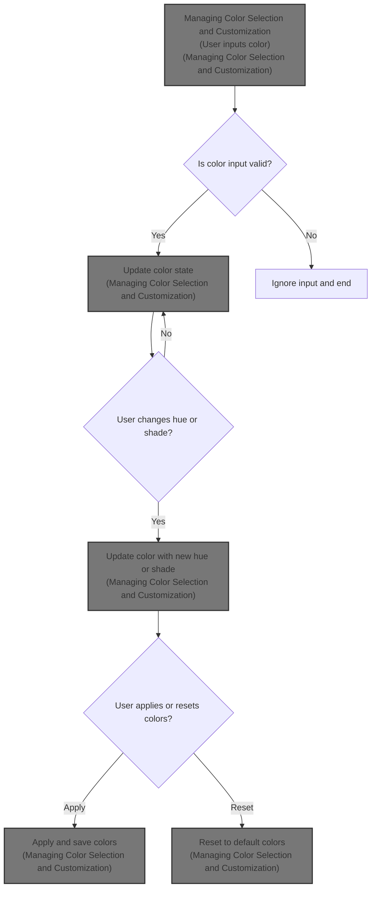
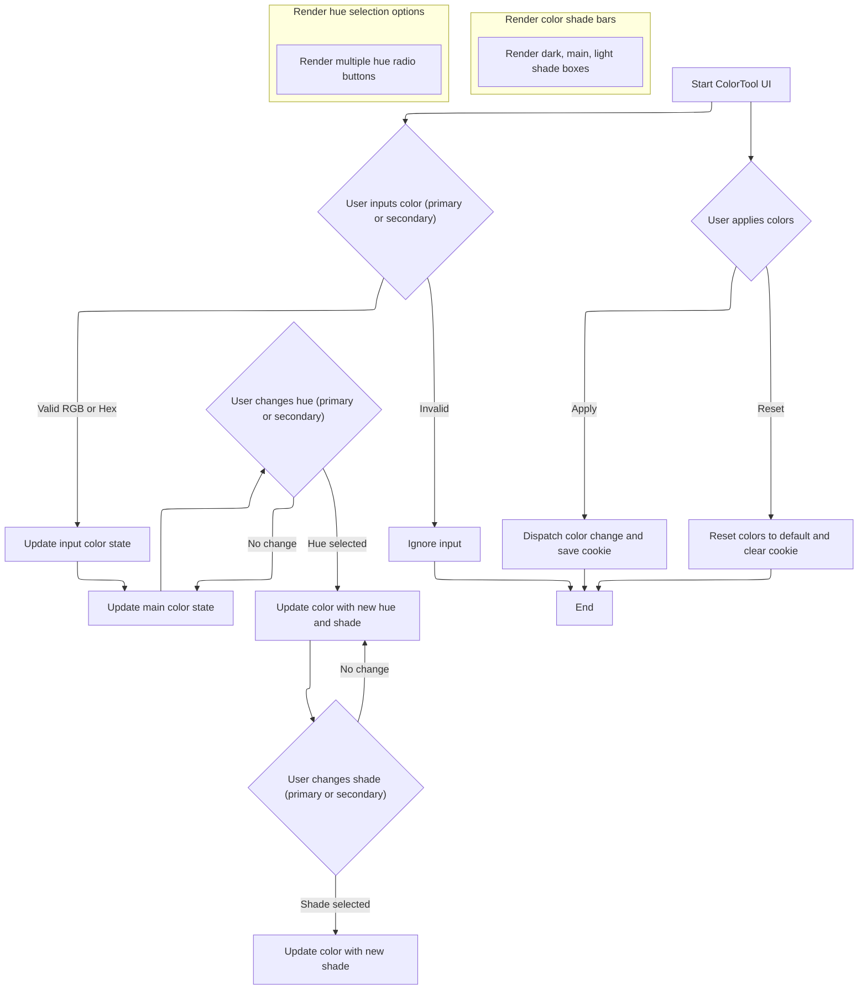

This document describes the flow of managing color selection and customization for primary and secondary colors in the Material UI theme documentation. Users input colors, select hues and shades independently, and apply or reset these colors. The flow outputs updated theme colors that persist user customizations or reset to defaults.



# Managing Color Selection and Customization



This section manages the color selection and customization for primary and secondary colors in the Material UI theme. It allows users to input colors, select hues and shades, and apply or reset these colors for the documentation theme.

| Category       | Rule Name                       | Description                                                                                                                                                              |
| -------------- | ------------------------------- | ------------------------------------------------------------------------------------------------------------------------------------------------------------------------ |
| Business logic | Independent color customization | Users can independently select and customize primary and secondary colors, including their hues and shades, without affecting each other.                                |
| Business logic | Hue and shade synchronization   | When a hue is selected, the color updates to the corresponding hue and current shade; when a shade is selected, the color updates to the current hue and selected shade. |
| Business logic | Apply colors persistence        | Applying colors dispatches a change event to update the documentation theme colors and saves the selected colors in a cookie for persistence up to one year.             |
| Business logic | Reset colors                    | Resetting colors restores the default theme colors and clears the saved color cookie, removing any user customizations.                                                  |

<SwmSnippet path="/docs/data/material/customization/color/ColorTool.js" line="86">

---

<SwmToken path="docs/data/material/customization/color/ColorTool.js" pos="86:2:2" line-data="function ColorTool() {">`ColorTool`</SwmToken> is the main component managing the color customization state and handlers. It keeps track of primary and secondary colors, their hues, shades, and input values. The <SwmToken path="docs/data/material/customization/color/ColorTool.js" pos="213:3:3" line-data="  const colorPicker = (intent) =&gt; {">`colorPicker`</SwmToken> function is called twice inside the return statement to render the UI controls for both primary and secondary colors, which lets users pick and adjust colors independently.

```javascript
function ColorTool() {
  const dispatch = React.useContext(DispatchContext);
  const theme = useTheme();
  const [state, setState] = React.useState({
    primary: defaults.primary,
    secondary: defaults.secondary,
    primaryInput: defaults.primary,
    secondaryInput: defaults.secondary,
    primaryHue: 'blue',
    secondaryHue: 'pink',
    primaryShade: 4,
    secondaryShade: 11,
  });

  const handleChangeColor = (name) => (event) => {
    const isRgb = (string) =>
      /rgb\([0-9]{1,3}\s*,\s*[0-9]{1,3}\s*,\s*[0-9]{1,3}\)/i.test(string);

    const isHex = (string) => /^#?([0-9a-f]{3})$|^#?([0-9a-f]){6}$/i.test(string);

    let {
      target: { value: color },
    } = event;

    setState((prevState) => ({
      ...prevState,
      [`${name}Input`]: color,
    }));

    let isValidColor = false;

    if (isRgb(color)) {
      isValidColor = true;
    } else if (isHex(color)) {
      isValidColor = true;
      if (!color.includes('#')) {
        color = `#${color}`;
      }
    }

    if (isValidColor) {
      setState((prevState) => ({
        ...prevState,
        [name]: color,
      }));
    }
  };

  const handleChangeHue = (name) => (event) => {
    const hue = event.target.value;
    const color = colors[hue][shades[state[`${name}Shade`]]];

    setState({
      ...state,
      [`${name}Hue`]: hue,
      [name]: color,
      [`${name}Input`]: color,
    });
  };

  const handleChangeShade = (name) => (event, shade) => {
    const color = colors[state[`${name}Hue`]][shades[shade]];
    setState({
      ...state,
      [`${name}Shade`]: shade,
      [name]: color,
      [`${name}Input`]: color,
    });
  };

  const handleChangeDocsColors = () => {
    const paletteColors = {
      primary: { ...colors[state.primaryHue], main: state.primary },
      secondary: { ...colors[state.secondaryHue], main: state.secondary },
    };

    dispatch({
      type: 'CHANGE',
      payload: { paletteColors },
    });

    document.cookie = `paletteColors=${JSON.stringify(
      paletteColors,
    )};path=/;max-age=31536000`;
  };

  const handleResetDocsColors = () => {
    dispatch({ type: 'RESET_COLORS' });

    document.cookie = 'paletteColors=;path=/;max-age=0';
  };

  const colorBar = (color) => {
    const background = theme.palette.augmentColor({
      color: {
        main: color,
      },
    });

    return (
      <Grid container sx={{ mt: 2 }}>
        {['dark', 'main', 'light'].map((key) => (
          <Box
            sx={{
              width: 64,
              height: 64,
              display: 'flex',
              justifyContent: 'center',
              alignItems: 'center',
            }}
            style={{ backgroundColor: background[key] }}
            key={key}
          >
            <Typography
              variant="caption"
              style={{
                color: theme.palette.getContrastText(background[key]),
              }}
            >
              {rgbToHex(background[key])}
            </Typography>
          </Box>
        ))}
      </Grid>
    );
  };

  const colorPicker = (intent) => {
    const intentInput = state[`${intent}Input`];
    const intentShade = state[`${intent}Shade`];
    const color = state[`${intent}`];

    return (
      <Grid item xs={12} sm={6} md={4}>
        <Typography component="label" gutterBottom htmlFor={intent} variant="h6">
          {capitalize(intent)}
        </Typography>
        <Input
          id={intent}
          value={intentInput}
          onChange={handleChangeColor(intent)}
          fullWidth
        />
        <Box sx={{ display: 'flex', alignItems: 'center', mt: 2, mb: 2 }}>
          <Typography id={`${intent}ShadeSliderLabel`}>Shade:</Typography>
          <Slider
            sx={{ width: 'calc(100% - 80px)', ml: 3, mr: 3 }}
            value={intentShade}
            min={0}
            max={13}
            step={1}
            onChange={handleChangeShade(intent)}
            aria-labelledby={`${intent}ShadeSliderLabel`}
          />
          <Typography minWidth={40}>{shades[intentShade]}</Typography>
        </Box>
        <Box sx={{ width: 192 }}>
          {hues.map((hue) => {
            const shade =
              intent === 'primary'
                ? shades[state.primaryShade]
                : shades[state.secondaryShade];
            const backgroundColor = colors[hue][shade];

            return (
              <Tooltip placement="right" title={hue} key={hue}>
                <TooltipRadio
                  sx={{ p: 0 }}
                  color="default"
                  checked={state[intent] === backgroundColor}
                  onChange={handleChangeHue(intent)}
                  value={hue}
                  name={intent}
                  icon={
                    <Box
                      sx={{ width: 48, height: 48 }}
                      style={{ backgroundColor }}
                    />
                  }
                  checkedIcon={
                    <Box
                      sx={{
                        width: 48,
                        height: 48,
                        border: 1,
                        borderColor: 'white',
                        color: 'common.white',
                        display: 'flex',
                        justifyContent: 'center',
                        alignItems: 'center',
                      }}
                      style={{ backgroundColor }}
                    >
                      <CheckIcon style={{ fontSize: 30 }} />
                    </Box>
                  }
                />
              </Tooltip>
            );
          })}
        </Box>
        {colorBar(color)}
      </Grid>
    );
  };

  return (
    <Grid container spacing={5} sx={{ p: 0 }}>
      {colorPicker('primary')}
      {colorPicker('secondary')}
      <Grid item xs={12} sm={6} md={4}>
        <ColorDemo data={state} />
      </Grid>
      <Grid item xs={12}>
        <Button variant="contained" onClick={handleChangeDocsColors}>
          Set Docs Colors
        </Button>
        <Button variant="outlined" onClick={handleResetDocsColors} sx={{ ml: 1 }}>
          Reset Docs Colors
        </Button>
      </Grid>
    </Grid>
  );
}
```

---

</SwmSnippet>

<SwmSnippet path="/docs/data/material/customization/color/ColorTool.js" line="213">

---

<SwmToken path="docs/data/material/customization/color/ColorTool.js" pos="213:3:3" line-data="  const colorPicker = (intent) =&gt; {">`colorPicker`</SwmToken> renders the UI controls for either primary or secondary color based on the intent argument. It uses dynamic state keys like `${intent}Input` and `${intent}Shade` to get the right color values. The function maps over hues and uses shades constants to show color options, and uses custom components like <SwmToken path="docs/data/material/customization/color/ColorTool.js" pos="252:2:2" line-data="                &lt;TooltipRadio">`TooltipRadio`</SwmToken> for hue selection and <SwmToken path="docs/data/material/customization/color/ColorTool.js" pos="287:2:2" line-data="        {colorBar(color)}">`colorBar`</SwmToken> to preview the selected color.

```javascript
  const colorPicker = (intent) => {
    const intentInput = state[`${intent}Input`];
    const intentShade = state[`${intent}Shade`];
    const color = state[`${intent}`];

    return (
      <Grid item xs={12} sm={6} md={4}>
        <Typography component="label" gutterBottom htmlFor={intent} variant="h6">
          {capitalize(intent)}
        </Typography>
        <Input
          id={intent}
          value={intentInput}
          onChange={handleChangeColor(intent)}
          fullWidth
        />
        <Box sx={{ display: 'flex', alignItems: 'center', mt: 2, mb: 2 }}>
          <Typography id={`${intent}ShadeSliderLabel`}>Shade:</Typography>
          <Slider
            sx={{ width: 'calc(100% - 80px)', ml: 3, mr: 3 }}
            value={intentShade}
            min={0}
            max={13}
            step={1}
            onChange={handleChangeShade(intent)}
            aria-labelledby={`${intent}ShadeSliderLabel`}
          />
          <Typography minWidth={40}>{shades[intentShade]}</Typography>
        </Box>
        <Box sx={{ width: 192 }}>
          {hues.map((hue) => {
            const shade =
              intent === 'primary'
                ? shades[state.primaryShade]
                : shades[state.secondaryShade];
            const backgroundColor = colors[hue][shade];

            return (
              <Tooltip placement="right" title={hue} key={hue}>
                <TooltipRadio
                  sx={{ p: 0 }}
                  color="default"
                  checked={state[intent] === backgroundColor}
                  onChange={handleChangeHue(intent)}
                  value={hue}
                  name={intent}
                  icon={
                    <Box
                      sx={{ width: 48, height: 48 }}
                      style={{ backgroundColor }}
                    />
                  }
                  checkedIcon={
                    <Box
                      sx={{
                        width: 48,
                        height: 48,
                        border: 1,
                        borderColor: 'white',
                        color: 'common.white',
                        display: 'flex',
                        justifyContent: 'center',
                        alignItems: 'center',
                      }}
                      style={{ backgroundColor }}
                    >
                      <CheckIcon style={{ fontSize: 30 }} />
                    </Box>
                  }
                />
              </Tooltip>
            );
          })}
        </Box>
        {colorBar(color)}
      </Grid>
    );
  };
```

---

</SwmSnippet>

&nbsp;

*This is an auto-generated document by Swimm 🌊 and has not yet been verified by a human*

<SwmMeta version="3.0.0" repo-id="Z2l0aHViJTNBJTNBVHlwZVNjcmlwdFhtYXRlcmlhbC11aSUzQSUzQUdvcGluYXRocmVkZHk2Ng==" repo-name="TypeScriptXmaterial-ui"><sup>Powered by [Swimm](https://app.swimm.io/)</sup></SwmMeta>
