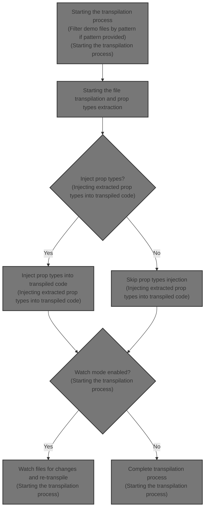
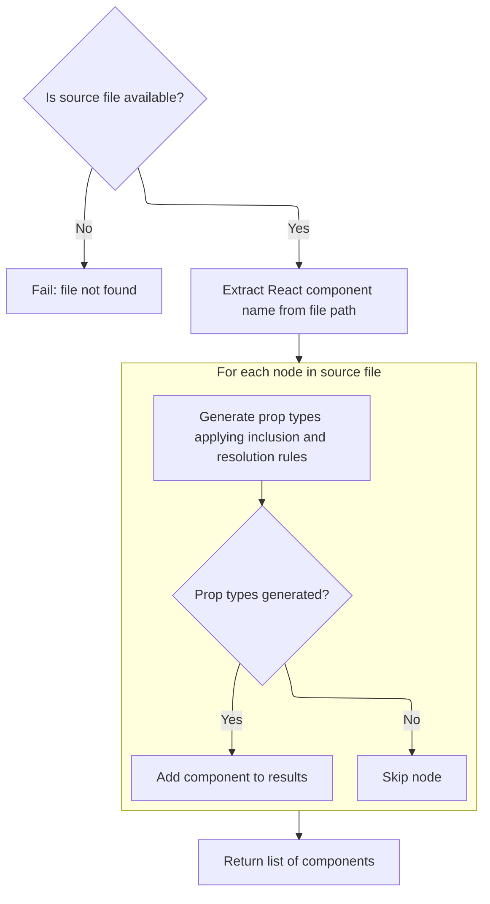
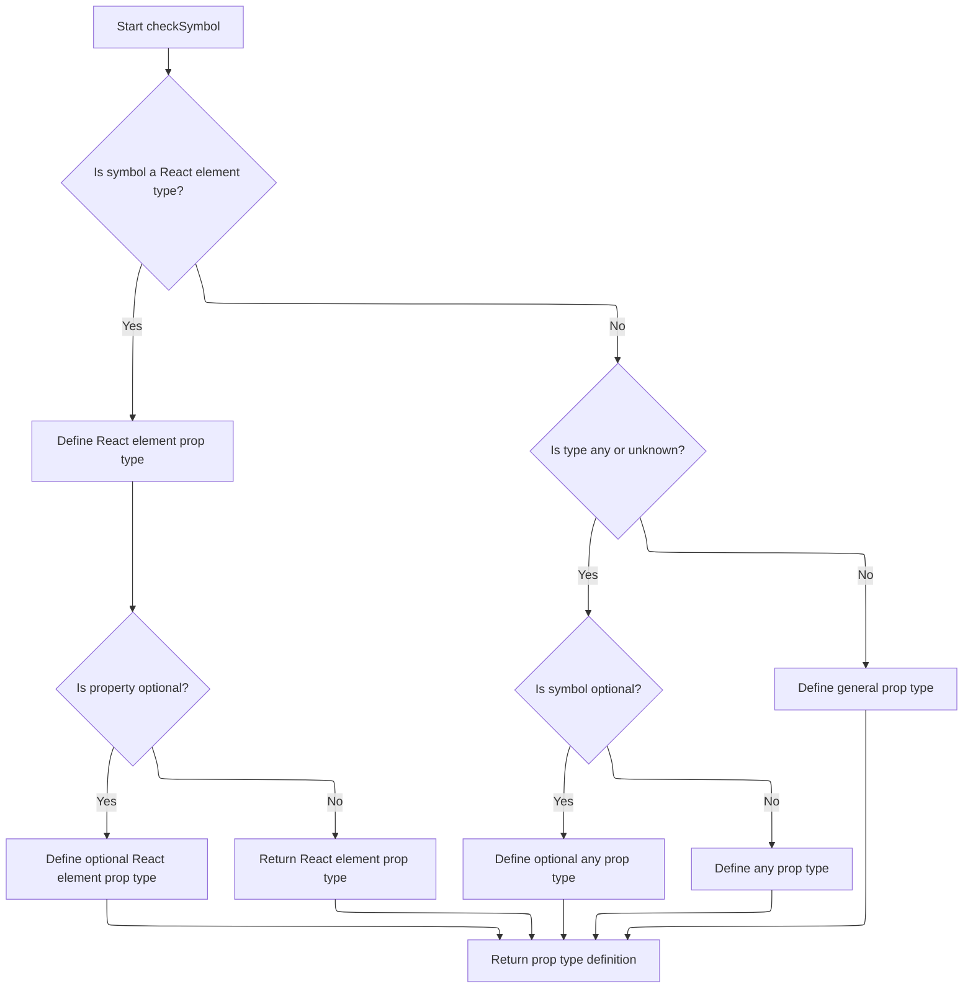

This document describes the flow of transpiling <SwmToken path="docs/scripts/formattedTSDemos.js" pos="102:8:8" line-data="      throw new Error(&#39;TypeScript demo contains prop-types, please remove them&#39;);">`TypeScript`</SwmToken> demo files to <SwmToken path="docs/scripts/formattedTSDemos.js" pos="3:13:13" line-data=" * Transpiles TypeScript demos to formatted JavaScript.">`JavaScript`</SwmToken> with injected React prop types. It covers filtering files by pattern, extracting prop types from source files, injecting them into transpiled code, formatting, and optionally watching files for changes to re-transpile. This flow supports the documentation and demo system by ensuring demos are type-safe and current.



# Starting the transpilation process

```mermaid
%%{init: {"flowchart": {"defaultRenderer": "elk"}} }%%
flowchart TD
    node1["Start main function"] --> node2{"Disable cache flag used?"}
    click node1 openCode "docs/scripts/formattedTSDemos.js:139:140"
    node2 -->|"Yes"| node3["Warn user disableCache is no-op"]
    click node2 openCode "docs/scripts/formattedTSDemos.js:145:149"
    node2 -->|"No"| node4
    node3 --> node4
    node4{"Pattern length > 0?"}
    click node3 openCode "docs/scripts/formattedTSDemos.js:146:149"
    node4 -->|"Yes"| node5["Log pattern used for filtering"]
    click node4 openCode "docs/scripts/formattedTSDemos.js:152:154"
    node4 -->|"No"| node5
    node5 --> node6["Filter demo files by pattern"]
    click node5 openCode "docs/scripts/formattedTSDemos.js:151:159"
    node6 --> subgraph loop1["For each demo file to transpile"]
        node7["Transpile file and count result"]
        click node7 openCode "docs/scripts/formattedTSDemos.js:167:186"
    end
    loop1 --> node8["Log summary of transpilation results"]
    click node8 openCode "docs/scripts/formattedTSDemos.js:188:196"
    node8 --> node9{"Watch mode enabled?"}
    click node9 openCode "docs/scripts/formattedTSDemos.js:198:199"
    node9 -->|"No"| node10{"Any failures?"}
    click node10 openCode "docs/scripts/formattedTSDemos.js:199:201"
    node10 -->|"Yes"| node11["Exit process with error"]
    click node11 openCode "docs/scripts/formattedTSDemos.js:200:201"
    node10 -->|"No"| node12["Return from main"]
    click node12 openCode "docs/scripts/formattedTSDemos.js:202:204"
    node9 -->|"Yes"| subgraph loop2["For each demo file to watch"]
        node13["Watch file for changes and re-transpile"]
        click node13 openCode "docs/scripts/formattedTSDemos.js:205:211"
    end
    loop2 --> node14["Log watching message"]
    click node14 openCode "docs/scripts/formattedTSDemos.js:213:214"
    node14 --> node12
classDef HeadingStyle fill:#777777,stroke:#333,stroke-width:2px;

%% Swimm:
%% %%{init: {"flowchart": {"defaultRenderer": "elk"}} }%%
%% flowchart TD
%%     node1["Start main function"] --> node2{"Disable cache flag used?"}
%%     click node1 openCode "<SwmPath>[docs/scripts/formattedTSDemos.js](docs/scripts/formattedTSDemos.js)</SwmPath>:139:140"
%%     node2 -->|"Yes"| node3["Warn user <SwmToken path="docs/scripts/formattedTSDemos.js" pos="140:11:11" line-data="  const { watch: watchMode, disableCache, pattern } = argv;">`disableCache`</SwmToken> is <SwmToken path="docs/scripts/formattedTSDemos.js" pos="144:9:11" line-data="  // It&#39;s a no-op anyway.">`no-op`</SwmToken>"]
%%     click node2 openCode "<SwmPath>[docs/scripts/formattedTSDemos.js](docs/scripts/formattedTSDemos.js)</SwmPath>:145:149"
%%     node2 -->|"No"| node4
%%     node3 --> node4
%%     node4{"Pattern length > 0?"}
%%     click node3 openCode "<SwmPath>[docs/scripts/formattedTSDemos.js](docs/scripts/formattedTSDemos.js)</SwmPath>:146:149"
%%     node4 -->|"Yes"| node5["Log pattern used for filtering"]
%%     click node4 openCode "<SwmPath>[docs/scripts/formattedTSDemos.js](docs/scripts/formattedTSDemos.js)</SwmPath>:152:154"
%%     node4 -->|"No"| node5
%%     node5 --> node6["Filter demo files by pattern"]
%%     click node5 openCode "<SwmPath>[docs/scripts/formattedTSDemos.js](docs/scripts/formattedTSDemos.js)</SwmPath>:151:159"
%%     node6 --> subgraph loop1["For each demo file to transpile"]
%%         node7["Transpile file and count result"]
%%         click node7 openCode "<SwmPath>[docs/scripts/formattedTSDemos.js](docs/scripts/formattedTSDemos.js)</SwmPath>:167:186"
%%     end
%%     loop1 --> node8["Log summary of transpilation results"]
%%     click node8 openCode "<SwmPath>[docs/scripts/formattedTSDemos.js](docs/scripts/formattedTSDemos.js)</SwmPath>:188:196"
%%     node8 --> node9{"Watch mode enabled?"}
%%     click node9 openCode "<SwmPath>[docs/scripts/formattedTSDemos.js](docs/scripts/formattedTSDemos.js)</SwmPath>:198:199"
%%     node9 -->|"No"| node10{"Any failures?"}
%%     click node10 openCode "<SwmPath>[docs/scripts/formattedTSDemos.js](docs/scripts/formattedTSDemos.js)</SwmPath>:199:201"
%%     node10 -->|"Yes"| node11["Exit process with error"]
%%     click node11 openCode "<SwmPath>[docs/scripts/formattedTSDemos.js](docs/scripts/formattedTSDemos.js)</SwmPath>:200:201"
%%     node10 -->|"No"| node12["Return from main"]
%%     click node12 openCode "<SwmPath>[docs/scripts/formattedTSDemos.js](docs/scripts/formattedTSDemos.js)</SwmPath>:202:204"
%%     node9 -->|"Yes"| subgraph loop2["For each demo file to watch"]
%%         node13["Watch file for changes and re-transpile"]
%%         click node13 openCode "<SwmPath>[docs/scripts/formattedTSDemos.js](docs/scripts/formattedTSDemos.js)</SwmPath>:205:211"
%%     end
%%     loop2 --> node14["Log watching message"]
%%     click node14 openCode "<SwmPath>[docs/scripts/formattedTSDemos.js](docs/scripts/formattedTSDemos.js)</SwmPath>:213:214"
%%     node14 --> node12
%% classDef HeadingStyle fill:#777777,stroke:#333,stroke-width:2px;
```

This section describes the process of transpiling demo files from <SwmToken path="docs/scripts/formattedTSDemos.js" pos="102:8:8" line-data="      throw new Error(&#39;TypeScript demo contains prop-types, please remove them&#39;);">`TypeScript`</SwmToken> to <SwmToken path="docs/scripts/formattedTSDemos.js" pos="3:13:13" line-data=" * Transpiles TypeScript demos to formatted JavaScript.">`JavaScript`</SwmToken>, including filtering files by pattern, handling transpilation results, and optionally watching files for changes to re-transpile.

| Category       | Rule Name                    | Description                                                                                                                                     |
| -------------- | ---------------------------- | ----------------------------------------------------------------------------------------------------------------------------------------------- |
| Business logic | Pattern-based file filtering | Only demo files matching the provided pattern are considered for transpilation.                                                                 |
| Business logic | Transpilation result summary | The system counts the number of successful and failed transpilation attempts and logs a summary of these results.                               |
| Business logic | Watch mode re-transpilation  | If watch mode is enabled, the system watches each demo file for changes and re-transpiles the file upon modification, logging success messages. |

<SwmSnippet path="/docs/scripts/formattedTSDemos.js" line="139">

---

<SwmToken path="docs/scripts/formattedTSDemos.js" pos="139:4:4" line-data="async function main(argv) {">`main`</SwmToken> starts by gathering all demo files matching a pattern, then creates a <SwmToken path="docs/scripts/formattedTSDemos.js" pos="102:8:8" line-data="      throw new Error(&#39;TypeScript demo contains prop-types, please remove them&#39;);">`TypeScript`</SwmToken> project for them. Next, it calls <SwmToken path="docs/scripts/formattedTSDemos.js" pos="169:3:3" line-data="        return transpileFile(file, project);">`transpileFile`</SwmToken> on each file to convert them to <SwmToken path="docs/scripts/formattedTSDemos.js" pos="3:13:13" line-data=" * Transpiles TypeScript demos to formatted JavaScript.">`JavaScript`</SwmToken>. This is how the flow processes each demo file to produce transpiled output.

```javascript
async function main(argv) {
  const { watch: watchMode, disableCache, pattern } = argv;

  // TODO: Remove at some point.
  // Though not too soon so that it isn't disruptive.
  // It's a no-op anyway.
  if (disableCache !== undefined) {
    console.warn(
      '--disable-cache does not have any effect since it is the default. In the future passing this flag will throw.',
    );
  }

  const filePattern = new RegExp(pattern);
  if (pattern.length > 0) {
    console.log(`Only considering demos matching ${filePattern}`);
  }

  const tsxFiles = [
    ...(await getFiles(path.join(workspaceRoot, 'docs/src/pages'))), // old structure
    ...(await getFiles(path.join(workspaceRoot, 'docs/data'))), // new structure
  ].filter((fileName) => filePattern.test(fileName));

  const buildProject = createTypeScriptProjectBuilder(CORE_TYPESCRIPT_PROJECTS);
  const project = buildProject('docs', { files: tsxFiles });

  let successful = 0;
  let failed = 0;
  (
    await Promise.all(
      tsxFiles.map((file) => {
        return transpileFile(file, project);
      }),
    )
  ).forEach((result) => {
    switch (result) {
      case TranspileResult.Success: {
        successful += 1;
        break;
      }
      case TranspileResult.Failed: {
        failed += 1;
        break;
      }
      default: {
        throw new Error(`No handler for ${result}`);
      }
    }
  });

  console.log(
    [
      '------ Summary ------',
      '%i demo(s) were successfully transpiled',
      '%i demo(s) were unsuccessful',
    ].join('\n'),
    successful,
    failed,
  );

  if (!watchMode) {
    if (failed > 0) {
      process.exit(1);
    }
    return;
  }

  tsxFiles.forEach((filePath) => {
    fse.watchFile(filePath, { interval: 500 }, async () => {
      if ((await transpileFile(filePath, project, true)) === 0) {
        console.log('Success - %s', filePath);
      }
    });
  });

  console.log('\nWatching for file changes...');
}
```

---

</SwmSnippet>

# Starting the file transpilation and prop types extraction

```mermaid
%%{init: {"flowchart": {"defaultRenderer": "elk"}} }%%
flowchart TD
    node1["Read TypeScript source file"] --> node2{"Enable JSX preview?"}
    node2 -->|"Yes"| node3["Prepare JSX preview transformation"]
    node2 -->|"No"| node3
    node3 --> node4["Transpile TypeScript to JavaScript"]
    node4 --> node5["Validate no prop-types import"]
    node5 --> node6["Extract PropTypes from AST"]
    node6 --> node7["Transforming code to inject prop types with Babel"]
    node7 --> node8["Format and save JS file"]
    
    click node1 openCode "docs/scripts/formattedTSDemos.js:82:87"
    
    click node3 openCode "docs/scripts/formattedTSDemos.js:91:99"
    click node4 openCode "docs/scripts/formattedTSDemos.js:99:101"
    click node5 openCode "docs/scripts/formattedTSDemos.js:101:104"
    click node6 openCode "docs/scripts/formattedTSDemos.js:107:117"
    
    click node8 openCode "docs/scripts/formattedTSDemos.js:119:132"
classDef HeadingStyle fill:#777777,stroke:#333,stroke-width:2px;
click node2 goToHeading "Extracting prop types from source files"
node2:::HeadingStyle
click node7 goToHeading "Transforming code to inject prop types with Babel"
node7:::HeadingStyle

%% Swimm:
%% %%{init: {"flowchart": {"defaultRenderer": "elk"}} }%%
%% flowchart TD
%%     node1["Read <SwmToken path="docs/scripts/formattedTSDemos.js" pos="102:8:8" line-data="      throw new Error(&#39;TypeScript demo contains prop-types, please remove them&#39;);">`TypeScript`</SwmToken> source file"] --> node2{"Enable JSX preview?"}
%%     node2 -->|"Yes"| node3["Prepare JSX preview transformation"]
%%     node2 -->|"No"| node3
%%     node3 --> node4["Transpile <SwmToken path="docs/scripts/formattedTSDemos.js" pos="102:8:8" line-data="      throw new Error(&#39;TypeScript demo contains prop-types, please remove them&#39;);">`TypeScript`</SwmToken> to <SwmToken path="docs/scripts/formattedTSDemos.js" pos="3:13:13" line-data=" * Transpiles TypeScript demos to formatted JavaScript.">`JavaScript`</SwmToken>"]
%%     node4 --> node5["Validate no <SwmToken path="docs/scripts/formattedTSDemos.js" pos="101:14:16" line-data="    if (/import \w* from &#39;prop-types&#39;/.test(code)) {">`prop-types`</SwmToken> import"]
%%     node5 --> node6["Extract <SwmToken path="packages-internal/scripts/typescript-to-proptypes/src/injectPropTypesInFile.ts" pos="255:6:6" line-data="            importName = &#39;PropTypes&#39;;">`PropTypes`</SwmToken> from AST"]
%%     node6 --> node7["Transforming code to inject prop types with Babel"]
%%     node7 --> node8["Format and save JS file"]
%%     
%%     click node1 openCode "<SwmPath>[docs/scripts/formattedTSDemos.js](docs/scripts/formattedTSDemos.js)</SwmPath>:82:87"
%%     
%%     click node3 openCode "<SwmPath>[docs/scripts/formattedTSDemos.js](docs/scripts/formattedTSDemos.js)</SwmPath>:91:99"
%%     click node4 openCode "<SwmPath>[docs/scripts/formattedTSDemos.js](docs/scripts/formattedTSDemos.js)</SwmPath>:99:101"
%%     click node5 openCode "<SwmPath>[docs/scripts/formattedTSDemos.js](docs/scripts/formattedTSDemos.js)</SwmPath>:101:104"
%%     click node6 openCode "<SwmPath>[docs/scripts/formattedTSDemos.js](docs/scripts/formattedTSDemos.js)</SwmPath>:107:117"
%%     
%%     click node8 openCode "<SwmPath>[docs/scripts/formattedTSDemos.js](docs/scripts/formattedTSDemos.js)</SwmPath>:119:132"
%% classDef HeadingStyle fill:#777777,stroke:#333,stroke-width:2px;
%% click node2 goToHeading "Extracting prop types from source files"
%% node2:::HeadingStyle
%% click node7 goToHeading "Transforming code to inject prop types with Babel"
%% node7:::HeadingStyle
```



This section handles the transpilation of <SwmToken path="docs/scripts/formattedTSDemos.js" pos="102:8:8" line-data="      throw new Error(&#39;TypeScript demo contains prop-types, please remove them&#39;);">`TypeScript`</SwmToken> source files to <SwmToken path="docs/scripts/formattedTSDemos.js" pos="3:13:13" line-data=" * Transpiles TypeScript demos to formatted JavaScript.">`JavaScript`</SwmToken>, including the extraction and injection of prop types to ensure type safety and consistency in the codebase.

| Category        | Rule Name                                                                                                                                                                          | Description                                                                                                                                                                                                                                                                                                                                                                                                                                                                                                     |
| --------------- | ---------------------------------------------------------------------------------------------------------------------------------------------------------------------------------- | --------------------------------------------------------------------------------------------------------------------------------------------------------------------------------------------------------------------------------------------------------------------------------------------------------------------------------------------------------------------------------------------------------------------------------------------------------------------------------------------------------------- |
| Data validation | Disallow <SwmToken path="docs/scripts/formattedTSDemos.js" pos="101:14:16" line-data="    if (/import \w* from &#39;prop-types&#39;/.test(code)) {">`prop-types`</SwmToken> import | The transpiled <SwmToken path="docs/scripts/formattedTSDemos.js" pos="3:13:13" line-data=" * Transpiles TypeScript demos to formatted JavaScript.">`JavaScript`</SwmToken> code must not contain any import statements from <SwmToken path="docs/scripts/formattedTSDemos.js" pos="101:14:16" line-data="    if (/import \w* from &#39;prop-types&#39;/.test(code)) {">`prop-types`</SwmToken>; if such imports are detected, the process must throw an error to enforce type handling consistency.             |
| Business logic  | JSX preview enablement                                                                                                                                                             | If the source file is located within <SwmPath>[docs/pages/premium-themes/](docs/pages/premium-themes/)</SwmPath> or <SwmPath>[docs/…/getting-started/templates/](docs/data/joy/getting-started/templates/)</SwmPath>, the JSX preview transformation must be disabled to control output size and relevance.                                                                                                                                                                                                     |
| Business logic  | Prop types extraction                                                                                                                                                              | Prop types must be extracted from the <SwmToken path="docs/scripts/formattedTSDemos.js" pos="102:8:8" line-data="      throw new Error(&#39;TypeScript demo contains prop-types, please remove them&#39;);">`TypeScript`</SwmToken> source file's AST to enable their injection into the transpiled <SwmToken path="docs/scripts/formattedTSDemos.js" pos="3:13:13" line-data=" * Transpiles TypeScript demos to formatted JavaScript.">`JavaScript`</SwmToken>, ensuring type safety and developer experience. |
| Business logic  | Exclude specific props from resolution                                                                                                                                             | Certain prop names such as 'classes', <SwmToken path="docs/scripts/formattedTSDemos.js" pos="111:19:19" line-data="        if (name === &#39;classes&#39; \|\| name === &#39;ownerState&#39; \|\| name === &#39;popper&#39;) {">`ownerState`</SwmToken>, and 'popper' must not be resolved during prop types extraction to avoid unnecessary or irrelevant type resolution.                                                                                                                                     |

<SwmSnippet path="/docs/scripts/formattedTSDemos.js" line="82">

---

In <SwmToken path="docs/scripts/formattedTSDemos.js" pos="82:4:4" line-data="async function transpileFile(tsxPath, project) {">`transpileFile`</SwmToken>, we read the source file and prepare Babel options. We enable a JSX preview plugin only for certain files to control output. After Babel transforms the code, we check for forbidden <SwmToken path="docs/scripts/formattedTSDemos.js" pos="101:14:16" line-data="    if (/import \w* from &#39;prop-types&#39;/.test(code)) {">`prop-types`</SwmToken> imports and throw if found. Then, we extract prop types from the source to inject them later, which is key for this repo's type handling.

```javascript
async function transpileFile(tsxPath, project) {
  const jsPath = tsxPath.replace(/\.tsx?$/, '.js');
  try {
    const source = await fse.readFile(tsxPath, 'utf8');

    const transformOptions = { ...babelConfig, filename: tsxPath };
    const enableJSXPreview =
      !tsxPath.includes(path.join('pages', 'premium-themes')) &&
      !tsxPath.includes(path.join('getting-started', 'templates'));
    if (enableJSXPreview) {
      transformOptions.plugins = transformOptions.plugins.concat([
        [
          require.resolve('docs/src/modules/utils/babel-plugin-jsx-preview'),
          { maxLines: 16, outputFilename: `${tsxPath}.preview` },
        ],
      ]);
    }
    const { code } = await babel.transformAsync(source, transformOptions);

    if (/import \w* from 'prop-types'/.test(code)) {
      throw new Error('TypeScript demo contains prop-types, please remove them');
    }

    console.log(tsxPath);

    const propTypesAST = getPropTypesFromFile({
      project,
      filePath: tsxPath,
      shouldResolveObject: ({ name }) => {
        if (name === 'classes' || name === 'ownerState' || name === 'popper') {
          return false;
        }

        return undefined;
      },
    });
```

---

</SwmSnippet>

## Extracting prop types from source files



This section defines the process of extracting React component prop types from source files within a project, applying inclusion and resolution rules to generate a list of prop type components.

| Category       | Rule Name                     | Description                                                                                                                                                                                                                                                  |
| -------------- | ----------------------------- | ------------------------------------------------------------------------------------------------------------------------------------------------------------------------------------------------------------------------------------------------------------ |
| Business logic | Exclude reserved prop 'ref'   | Props named 'ref' are excluded from prop type generation because 'ref' is a reserved prop name in React and should not be included in prop types.                                                                                                            |
| Business logic | Custom prop inclusion         | Custom inclusion rules can be applied via an optional callback; if the callback returns a defined boolean, that value determines whether a prop is included, otherwise the default is to include the prop.                                                   |
| Business logic | Custom object resolution      | Custom object resolution rules can be applied via an optional callback; if the callback returns a defined boolean, that value determines whether an object type should be resolved, otherwise default limits on property count (<=50) and depth (<=3) apply. |
| Business logic | Include only valid components | Only nodes in the source file that successfully generate prop types are included in the final list of components; nodes that do not generate prop types are skipped.                                                                                         |

<SwmSnippet path="/packages-internal/scripts/typescript-to-proptypes/src/getPropTypesFromFile.ts" line="518">

---

<SwmToken path="packages-internal/scripts/typescript-to-proptypes/src/getPropTypesFromFile.ts" pos="518:4:4" line-data="export function getPropTypesFromFile({">`getPropTypesFromFile`</SwmToken> grabs the source file from the project and sets up rules for which props to include or resolve. It traverses the AST nodes, calling <SwmToken path="packages-internal/scripts/typescript-to-proptypes/src/getPropTypesFromFile.ts" pos="582:7:7" line-data="      const component = generatePropTypesFromNode({">`generatePropTypesFromNode`</SwmToken> on each to build prop types components for the file.

```typescript
export function getPropTypesFromFile({
  filePath,
  project,
  shouldInclude: inShouldInclude,
  shouldResolveObject: inShouldResolveObject,
  shouldUseObjectForDate,
  checkDeclarations,
}: GetPropTypesFromFileOptions) {
  const sourceFile = project.program.getSourceFile(filePath);
  const reactComponentName = filePath.match(/.*\/([^/]+)/)?.[1];
  const components: PropTypesComponent[] = [];
  const sigilIds: Map<ts.Symbol | ts.Type, number> = new Map();
  /**
   *
   * @param sigil - Prefer ts.Type if available since these are re-used in the type checker. Symbols (especially those for literals) are oftentimes re-created on every usage.
   */
  function createPropTypeId(sigil: ts.Symbol | ts.Type) {
    if (!sigilIds.has(sigil)) {
      sigilIds.set(sigil, sigilIds.size);
    }

    return sigilIds.get(sigil)!;
  }

  const shouldResolveObject: PropTypesProject['shouldResolveObject'] = (data) => {
    if (inShouldResolveObject) {
      const result = inShouldResolveObject(data);
      if (result !== undefined) {
        return result;
      }
    }

    return data.propertyCount <= 50 && data.depth <= 3;
  };

  const shouldInclude: PropTypesProject['shouldInclude'] = (data): boolean => {
    // ref is a reserved prop name in React
    // for example https://github.com/reactjs/rfcs/pull/107
    // no need to add a prop-type
    if (data.name === 'ref') {
      return false;
    }

    if (inShouldInclude) {
      const result = inShouldInclude(data);
      if (result !== undefined) {
        return result;
      }
    }

    return true;
  };

  const propTypesProject: PropTypesProject = {
    ...project,
    reactComponentName,
    shouldResolveObject,
    shouldUseObjectForDate,
    shouldInclude,
    createPropTypeId,
  };

  if (sourceFile) {
    ts.forEachChild(sourceFile, (node) => {
      const component = generatePropTypesFromNode({
        project: propTypesProject,
        node,
        shouldInclude,
        checkDeclarations,
      });
      if (component != null) {
        components.push(component);
      }
    });
  } else {
    throw new Error(`Program doesn't contain file "${filePath}"`);
  }

  return components;
}
```

---

</SwmSnippet>

## Parsing component nodes to build prop types

```mermaid
%%{init: {"flowchart": {"defaultRenderer": "elk"}} }%%
flowchart TD
    node1["Start: Generate prop types from component node"] --> node2{"Is component parsed successfully?"}
    click node1 openCode "packages-internal/scripts/typescript-to-proptypes/src/getPropTypesFromFile.ts:484:516"
    node2 -->|"No"| node3["Return null"]
    click node3 openCode "packages-internal/scripts/typescript-to-proptypes/src/getPropTypesFromFile.ts:488:490"
    node2 -->|"Yes"| node4["Extract props filename if available"]
    click node4 openCode "packages-internal/scripts/typescript-to-proptypes/src/getPropTypesFromFile.ts:492:494"
    node4 --> subgraph loop1["For each prop in component"]
        node5["Check signatures and consolidate type definitions"]
        click node5 openCode "packages-internal/scripts/typescript-to-proptypes/src/getPropTypesFromFile.ts:495:509"
    end
    loop1 --> node6["Return structured prop types object with name, types, and filename"]
    click node6 openCode "packages-internal/scripts/typescript-to-proptypes/src/getPropTypesFromFile.ts:511:516"
classDef HeadingStyle fill:#777777,stroke:#333,stroke-width:2px;

%% Swimm:
%% %%{init: {"flowchart": {"defaultRenderer": "elk"}} }%%
%% flowchart TD
%%     node1["Start: Generate prop types from component node"] --> node2{"Is component parsed successfully?"}
%%     click node1 openCode "<SwmPath>[packages-internal/…/src/getPropTypesFromFile.ts](packages-internal/scripts/typescript-to-proptypes/src/getPropTypesFromFile.ts)</SwmPath>:484:516"
%%     node2 -->|"No"| node3["Return null"]
%%     click node3 openCode "<SwmPath>[packages-internal/…/src/getPropTypesFromFile.ts](packages-internal/scripts/typescript-to-proptypes/src/getPropTypesFromFile.ts)</SwmPath>:488:490"
%%     node2 -->|"Yes"| node4["Extract props filename if available"]
%%     click node4 openCode "<SwmPath>[packages-internal/…/src/getPropTypesFromFile.ts](packages-internal/scripts/typescript-to-proptypes/src/getPropTypesFromFile.ts)</SwmPath>:492:494"
%%     node4 --> subgraph loop1["For each prop in component"]
%%         node5["Check signatures and consolidate type definitions"]
%%         click node5 openCode "<SwmPath>[packages-internal/…/src/getPropTypesFromFile.ts](packages-internal/scripts/typescript-to-proptypes/src/getPropTypesFromFile.ts)</SwmPath>:495:509"
%%     end
%%     loop1 --> node6["Return structured prop types object with name, types, and filename"]
%%     click node6 openCode "<SwmPath>[packages-internal/…/src/getPropTypesFromFile.ts](packages-internal/scripts/typescript-to-proptypes/src/getPropTypesFromFile.ts)</SwmPath>:511:516"
%% classDef HeadingStyle fill:#777777,stroke:#333,stroke-width:2px;
```

This section describes the process of parsing a component node to generate its prop types, consolidating type definitions from each prop's signatures, and returning a structured component descriptor.

| Category       | Rule Name                | Description                                                                                                                                           |
| -------------- | ------------------------ | ----------------------------------------------------------------------------------------------------------------------------------------------------- |
| Business logic | Include props filename   | The filename of the source file where the component's props are defined should be extracted and included in the output if available.                  |
| Business logic | Consolidate prop types   | For each prop in the component, all signatures must be checked and their type definitions consolidated into a unified prop type definition.           |
| Business logic | Structured output format | The final output must be a structured object containing the component's name, the consolidated prop types array, and the props filename if available. |

<SwmSnippet path="/packages-internal/scripts/typescript-to-proptypes/src/getPropTypesFromFile.ts" line="484">

---

<SwmToken path="packages-internal/scripts/typescript-to-proptypes/src/getPropTypesFromFile.ts" pos="484:2:2" line-data="function generatePropTypesFromNode(">`generatePropTypesFromNode`</SwmToken> parses a component node to get its props, then calls <SwmToken path="packages-internal/scripts/typescript-to-proptypes/src/getPropTypesFromFile.ts" pos="497:1:1" line-data="      checkSymbol({">`checkSymbol`</SwmToken> on each prop's signatures to analyze their types. It squashes these into unified prop type definitions and returns a component descriptor.

```typescript
function generatePropTypesFromNode(
  params: Omit<GetPropsFromComponentDeclarationOptions, 'project'> & { project: PropTypesProject },
): PropTypesComponent | null {
  const parsedComponent = getPropsFromComponentNode(params);
  if (parsedComponent == null) {
    return null;
  }

  const propsFilename =
    parsedComponent.sourceFile !== undefined ? parsedComponent.sourceFile.fileName : undefined;

  const types = Object.values(parsedComponent.props).map((prop) => {
    const propTypeDefinitions = prop.signatures.map(({ symbol, componentType }) =>
      checkSymbol({
        symbol,
        project: params.project,
        location: parsedComponent.location,
        typeStack: [(componentType as any).id],
      }),
    );

    return squashPropTypeDefinitions({
      propTypeDefinitions,
      onlyUsedInSomeSignatures: prop.onlyUsedInSomeSignatures,
    });
  });

  return {
    name: parsedComponent.name,
    types,
    propsFilename,
  };
}
```

---

</SwmSnippet>

## Analyzing symbols to determine prop types



This section analyzes <SwmToken path="docs/scripts/formattedTSDemos.js" pos="102:8:8" line-data="      throw new Error(&#39;TypeScript demo contains prop-types, please remove them&#39;);">`TypeScript`</SwmToken> symbols to determine the appropriate React prop types for components, handling special cases like React element types and optional 'any' types.

<SwmSnippet path="/packages-internal/scripts/typescript-to-proptypes/src/getPropTypesFromFile.ts" line="350">

---

<SwmToken path="packages-internal/scripts/typescript-to-proptypes/src/getPropTypesFromFile.ts" pos="350:2:2" line-data="function checkSymbol({">`checkSymbol`</SwmToken> inspects a symbol's declaration to detect React element types and creates special prop type nodes for them. It handles optional 'any' types by creating unions with undefined. For other types, it calls <SwmToken path="packages-internal/scripts/typescript-to-proptypes/src/getPropTypesFromFile.ts" pos="429:5:5" line-data="    parsedType = checkType({ type, location, typeStack, name: symbol.getName(), project });">`checkType`</SwmToken> to parse them normally.

```typescript
function checkSymbol({
  project,
  symbol,
  location,
  typeStack,
}: {
  project: PropTypesProject;
  symbol: ts.Symbol;
  location: ts.Node;
  typeStack: readonly number[];
}): PropTypeDefinition {
  const declarations = symbol.getDeclarations();
  const declaration = declarations && declarations[0];
  const symbolFilenames = getSymbolFileNames(symbol);
  const jsDoc = getSymbolDocumentation({ symbol, project });

  // TypeChecker keeps the name for
  // { a: React.ElementType, b: React.ReactElement | boolean }
  // but not
  // { a?: React.ElementType, b: React.ReactElement }
  // get around this by not using the TypeChecker
  if (
    declaration &&
    ts.isPropertySignature(declaration) &&
    declaration.type &&
    ts.isTypeReferenceNode(declaration.type)
  ) {
    const name = declaration.type.typeName.getText();
    if (
      name === 'React.ElementType' ||
      name === 'React.JSXElementConstructor' ||
      name === 'React.ReactElement'
    ) {
      const elementNode = createElementType({
        elementType: name === 'React.ReactElement' ? 'element' : 'elementType',
        jsDoc,
      });

      return {
        $$id: project.createPropTypeId(symbol),
        name: symbol.getName(),
        jsDoc,
        filenames: symbolFilenames,
        propType: declaration.questionToken
          ? createUnionType({
              jsDoc: elementNode.jsDoc,
              types: [
                createUndefinedType({ jsDoc: undefined }),
                {
                  ...elementNode,
                  // jsDoc was hoisted to the union type
                  jsDoc: undefined,
                },
              ],
            })
          : elementNode,
      };
    }
  }

  const type = getType({ project, symbol, declaration, location });

  // Typechecker only gives the type "any" if it's present in a union
  // This means the type of "a" in {a?:any} isn't "any | undefined"
  // So instead we check for the questionmark to detect optional types
  let parsedType: PropType | undefined;
  if (
    (type.flags & ts.TypeFlags.Any || type.flags & ts.TypeFlags.Unknown) &&
    declaration &&
    ts.isPropertySignature(declaration)
  ) {
    parsedType =
      symbol.flags & ts.SymbolFlags.Optional
        ? createUnionType({
            jsDoc,
            types: [createUndefinedType({ jsDoc: undefined }), createAnyType({ jsDoc: undefined })],
          })
        : createAnyType({ jsDoc });
  } else {
    parsedType = checkType({ type, location, typeStack, name: symbol.getName(), project });
  }

  return {
    $$id: project.createPropTypeId(type),
    name: symbol.getName(),
    jsDoc,
    propType: parsedType,
    filenames: symbolFilenames,
  };
}
```

---

</SwmSnippet>

## Recursively checking types and handling special cases

```mermaid
%%{init: {"flowchart": {"defaultRenderer": "elk"}} }%%
flowchart TD
    node1{"Is type recursive?"}
    node1 -->|"Yes"| node2["Return generic object PropType"]
    node1 -->|"No"| node3{"Is type a special React type?"}
    node3 -->|"Yes"| node4["Return specific React PropType"]
    node3 -->|"No"| node5{"Is type an array?"}
    node5 -->|"Yes"| node6["Return array PropType with element type"]
    node5 -->|"No"| node7{"Is type a tuple?"}
    node7 -->|"Yes"| node8["Return array PropType with union of element types"]
    node7 -->|"No"| node9{"Is type a union?"}
    node9 -->|"Yes"| node10["Return union PropType"]
    node9 -->|"No"| node11{"Is type a type parameter?"}
    node11 -->|"Yes"| node12["Resolve base constraint and recurse"]
    node11 -->|"No"| node13{"Is type a primitive?"}
    node13 -->|"Yes"| node14["Return corresponding primitive PropType"]
    node13 -->|"No"| node15{"Is type an indexed access with conditional?"}
    node15 -->|"Yes"| node16["Return union PropType from resolved types"]
    node15 -->|"No"| node17{"Has call signatures?"}
    node17 -->|"Yes"| node18["Return function PropType"]
    node17 -->|"No"| node19{"Has construct signatures?"}
    node19 -->|"Yes"| node20["Return function PropType"]
    node19 -->|"No"| node21{"Is object-like type with properties?"}
    node21 -->|"Yes"| node22["Return interface PropType with properties"]
    node21 -->|"No"| node23["Return generic object PropType"]

    click node1 openCode "packages-internal/scripts/typescript-to-proptypes/src/getPropTypesFromFile.ts:115:117"
    click node2 openCode "packages-internal/scripts/typescript-to-proptypes/src/getPropTypesFromFile.ts:116:117"
    click node3 openCode "packages-internal/scripts/typescript-to-proptypes/src/getPropTypesFromFile.ts:126:174"
    click node4 openCode "packages-internal/scripts/typescript-to-proptypes/src/getPropTypesFromFile.ts:131:150"
    click node5 openCode "packages-internal/scripts/typescript-to-proptypes/src/getPropTypesFromFile.ts:177:185"
    click node6 openCode "packages-internal/scripts/typescript-to-proptypes/src/getPropTypesFromFile.ts:181:184"
    click node7 openCode "packages-internal/scripts/typescript-to-proptypes/src/getPropTypesFromFile.ts:187:198"
    click node8 openCode "packages-internal/scripts/typescript-to-proptypes/src/getPropTypesFromFile.ts:189:197"
    click node9 openCode "packages-internal/scripts/typescript-to-proptypes/src/getPropTypesFromFile.ts:200:207"
    click node10 openCode "packages-internal/scripts/typescript-to-proptypes/src/getPropTypesFromFile.ts:201:206"
    click node11 openCode "packages-internal/scripts/typescript-to-proptypes/src/getPropTypesFromFile.ts:209:222"
    click node12 openCode "packages-internal/scripts/typescript-to-proptypes/src/getPropTypesFromFile.ts:220:221"
    click node13 openCode "packages-internal/scripts/typescript-to-proptypes/src/getPropTypesFromFile.ts:224:230"
    click node14 openCode "packages-internal/scripts/typescript-to-proptypes/src/getPropTypesFromFile.ts:225:229"
    click node15 openCode "packages-internal/scripts/typescript-to-proptypes/src/getPropTypesFromFile.ts:257:287"
    click node16 openCode "packages-internal/scripts/typescript-to-proptypes/src/getPropTypesFromFile.ts:261:286"
    click node17 openCode "packages-internal/scripts/typescript-to-proptypes/src/getPropTypesFromFile.ts:289:291"
    click node18 openCode "packages-internal/scripts/typescript-to-proptypes/src/getPropTypesFromFile.ts:290:291"
    click node19 openCode "packages-internal/scripts/typescript-to-proptypes/src/getPropTypesFromFile.ts:294:296"
    click node20 openCode "packages-internal/scripts/typescript-to-proptypes/src/getPropTypesFromFile.ts:295:296"
    click node21 openCode "packages-internal/scripts/typescript-to-proptypes/src/getPropTypesFromFile.ts:300:331"
    click node22 openCode "packages-internal/scripts/typescript-to-proptypes/src/getPropTypesFromFile.ts:313:326"
    click node23 openCode "packages-internal/scripts/typescript-to-proptypes/src/getPropTypesFromFile.ts:339:340"
classDef HeadingStyle fill:#777777,stroke:#333,stroke-width:2px;

%% Swimm:
%% %%{init: {"flowchart": {"defaultRenderer": "elk"}} }%%
%% flowchart TD
%%     node1{"Is type recursive?"}
%%     node1 -->|"Yes"| node2["Return generic object <SwmToken path="packages-internal/scripts/typescript-to-proptypes/src/getPropTypesFromFile.ts" pos="112:4:4" line-data="}): PropType {">`PropType`</SwmToken>"]
%%     node1 -->|"No"| node3{"Is type a special React type?"}
%%     node3 -->|"Yes"| node4["Return specific React <SwmToken path="packages-internal/scripts/typescript-to-proptypes/src/getPropTypesFromFile.ts" pos="112:4:4" line-data="}): PropType {">`PropType`</SwmToken>"]
%%     node3 -->|"No"| node5{"Is type an array?"}
%%     node5 -->|"Yes"| node6["Return array <SwmToken path="packages-internal/scripts/typescript-to-proptypes/src/getPropTypesFromFile.ts" pos="112:4:4" line-data="}): PropType {">`PropType`</SwmToken> with element type"]
%%     node5 -->|"No"| node7{"Is type a tuple?"}
%%     node7 -->|"Yes"| node8["Return array <SwmToken path="packages-internal/scripts/typescript-to-proptypes/src/getPropTypesFromFile.ts" pos="112:4:4" line-data="}): PropType {">`PropType`</SwmToken> with union of element types"]
%%     node7 -->|"No"| node9{"Is type a union?"}
%%     node9 -->|"Yes"| node10["Return union <SwmToken path="packages-internal/scripts/typescript-to-proptypes/src/getPropTypesFromFile.ts" pos="112:4:4" line-data="}): PropType {">`PropType`</SwmToken>"]
%%     node9 -->|"No"| node11{"Is type a type parameter?"}
%%     node11 -->|"Yes"| node12["Resolve base constraint and recurse"]
%%     node11 -->|"No"| node13{"Is type a primitive?"}
%%     node13 -->|"Yes"| node14["Return corresponding primitive <SwmToken path="packages-internal/scripts/typescript-to-proptypes/src/getPropTypesFromFile.ts" pos="112:4:4" line-data="}): PropType {">`PropType`</SwmToken>"]
%%     node13 -->|"No"| node15{"Is type an indexed access with conditional?"}
%%     node15 -->|"Yes"| node16["Return union <SwmToken path="packages-internal/scripts/typescript-to-proptypes/src/getPropTypesFromFile.ts" pos="112:4:4" line-data="}): PropType {">`PropType`</SwmToken> from resolved types"]
%%     node15 -->|"No"| node17{"Has call signatures?"}
%%     node17 -->|"Yes"| node18["Return function <SwmToken path="packages-internal/scripts/typescript-to-proptypes/src/getPropTypesFromFile.ts" pos="112:4:4" line-data="}): PropType {">`PropType`</SwmToken>"]
%%     node17 -->|"No"| node19{"Has construct signatures?"}
%%     node19 -->|"Yes"| node20["Return function <SwmToken path="packages-internal/scripts/typescript-to-proptypes/src/getPropTypesFromFile.ts" pos="112:4:4" line-data="}): PropType {">`PropType`</SwmToken>"]
%%     node19 -->|"No"| node21{"Is object-like type with properties?"}
%%     node21 -->|"Yes"| node22["Return interface <SwmToken path="packages-internal/scripts/typescript-to-proptypes/src/getPropTypesFromFile.ts" pos="112:4:4" line-data="}): PropType {">`PropType`</SwmToken> with properties"]
%%     node21 -->|"No"| node23["Return generic object <SwmToken path="packages-internal/scripts/typescript-to-proptypes/src/getPropTypesFromFile.ts" pos="112:4:4" line-data="}): PropType {">`PropType`</SwmToken>"]
%% 
%%     click node1 openCode "<SwmPath>[packages-internal/…/src/getPropTypesFromFile.ts](packages-internal/scripts/typescript-to-proptypes/src/getPropTypesFromFile.ts)</SwmPath>:115:117"
%%     click node2 openCode "<SwmPath>[packages-internal/…/src/getPropTypesFromFile.ts](packages-internal/scripts/typescript-to-proptypes/src/getPropTypesFromFile.ts)</SwmPath>:116:117"
%%     click node3 openCode "<SwmPath>[packages-internal/…/src/getPropTypesFromFile.ts](packages-internal/scripts/typescript-to-proptypes/src/getPropTypesFromFile.ts)</SwmPath>:126:174"
%%     click node4 openCode "<SwmPath>[packages-internal/…/src/getPropTypesFromFile.ts](packages-internal/scripts/typescript-to-proptypes/src/getPropTypesFromFile.ts)</SwmPath>:131:150"
%%     click node5 openCode "<SwmPath>[packages-internal/…/src/getPropTypesFromFile.ts](packages-internal/scripts/typescript-to-proptypes/src/getPropTypesFromFile.ts)</SwmPath>:177:185"
%%     click node6 openCode "<SwmPath>[packages-internal/…/src/getPropTypesFromFile.ts](packages-internal/scripts/typescript-to-proptypes/src/getPropTypesFromFile.ts)</SwmPath>:181:184"
%%     click node7 openCode "<SwmPath>[packages-internal/…/src/getPropTypesFromFile.ts](packages-internal/scripts/typescript-to-proptypes/src/getPropTypesFromFile.ts)</SwmPath>:187:198"
%%     click node8 openCode "<SwmPath>[packages-internal/…/src/getPropTypesFromFile.ts](packages-internal/scripts/typescript-to-proptypes/src/getPropTypesFromFile.ts)</SwmPath>:189:197"
%%     click node9 openCode "<SwmPath>[packages-internal/…/src/getPropTypesFromFile.ts](packages-internal/scripts/typescript-to-proptypes/src/getPropTypesFromFile.ts)</SwmPath>:200:207"
%%     click node10 openCode "<SwmPath>[packages-internal/…/src/getPropTypesFromFile.ts](packages-internal/scripts/typescript-to-proptypes/src/getPropTypesFromFile.ts)</SwmPath>:201:206"
%%     click node11 openCode "<SwmPath>[packages-internal/…/src/getPropTypesFromFile.ts](packages-internal/scripts/typescript-to-proptypes/src/getPropTypesFromFile.ts)</SwmPath>:209:222"
%%     click node12 openCode "<SwmPath>[packages-internal/…/src/getPropTypesFromFile.ts](packages-internal/scripts/typescript-to-proptypes/src/getPropTypesFromFile.ts)</SwmPath>:220:221"
%%     click node13 openCode "<SwmPath>[packages-internal/…/src/getPropTypesFromFile.ts](packages-internal/scripts/typescript-to-proptypes/src/getPropTypesFromFile.ts)</SwmPath>:224:230"
%%     click node14 openCode "<SwmPath>[packages-internal/…/src/getPropTypesFromFile.ts](packages-internal/scripts/typescript-to-proptypes/src/getPropTypesFromFile.ts)</SwmPath>:225:229"
%%     click node15 openCode "<SwmPath>[packages-internal/…/src/getPropTypesFromFile.ts](packages-internal/scripts/typescript-to-proptypes/src/getPropTypesFromFile.ts)</SwmPath>:257:287"
%%     click node16 openCode "<SwmPath>[packages-internal/…/src/getPropTypesFromFile.ts](packages-internal/scripts/typescript-to-proptypes/src/getPropTypesFromFile.ts)</SwmPath>:261:286"
%%     click node17 openCode "<SwmPath>[packages-internal/…/src/getPropTypesFromFile.ts](packages-internal/scripts/typescript-to-proptypes/src/getPropTypesFromFile.ts)</SwmPath>:289:291"
%%     click node18 openCode "<SwmPath>[packages-internal/…/src/getPropTypesFromFile.ts](packages-internal/scripts/typescript-to-proptypes/src/getPropTypesFromFile.ts)</SwmPath>:290:291"
%%     click node19 openCode "<SwmPath>[packages-internal/…/src/getPropTypesFromFile.ts](packages-internal/scripts/typescript-to-proptypes/src/getPropTypesFromFile.ts)</SwmPath>:294:296"
%%     click node20 openCode "<SwmPath>[packages-internal/…/src/getPropTypesFromFile.ts](packages-internal/scripts/typescript-to-proptypes/src/getPropTypesFromFile.ts)</SwmPath>:295:296"
%%     click node21 openCode "<SwmPath>[packages-internal/…/src/getPropTypesFromFile.ts](packages-internal/scripts/typescript-to-proptypes/src/getPropTypesFromFile.ts)</SwmPath>:300:331"
%%     click node22 openCode "<SwmPath>[packages-internal/…/src/getPropTypesFromFile.ts](packages-internal/scripts/typescript-to-proptypes/src/getPropTypesFromFile.ts)</SwmPath>:313:326"
%%     click node23 openCode "<SwmPath>[packages-internal/…/src/getPropTypesFromFile.ts](packages-internal/scripts/typescript-to-proptypes/src/getPropTypesFromFile.ts)</SwmPath>:339:340"
%% classDef HeadingStyle fill:#777777,stroke:#333,stroke-width:2px;
```



This section defines the business rules for recursively checking <SwmToken path="docs/scripts/formattedTSDemos.js" pos="102:8:8" line-data="      throw new Error(&#39;TypeScript demo contains prop-types, please remove them&#39;);">`TypeScript`</SwmToken> types and handling special cases to generate appropriate <SwmToken path="packages-internal/scripts/typescript-to-proptypes/src/injectPropTypesInFile.ts" pos="255:6:6" line-data="            importName = &#39;PropTypes&#39;;">`PropTypes`</SwmToken> for React components.

| Category       | Rule Name                            | Description                                                                                                                                                                                                                                                                                                                                                                                                                                                                                                                                                                                                                                                                                                                                                                                                                                                                                                                                                                                                                                                                                                                                                                                                                                    |
| -------------- | ------------------------------------ | ---------------------------------------------------------------------------------------------------------------------------------------------------------------------------------------------------------------------------------------------------------------------------------------------------------------------------------------------------------------------------------------------------------------------------------------------------------------------------------------------------------------------------------------------------------------------------------------------------------------------------------------------------------------------------------------------------------------------------------------------------------------------------------------------------------------------------------------------------------------------------------------------------------------------------------------------------------------------------------------------------------------------------------------------------------------------------------------------------------------------------------------------------------------------------------------------------------------------------------------------- |
| Business logic | Special React and DOM types handling | Special React and DOM types such as <SwmToken path="packages-internal/scripts/typescript-to-proptypes/src/getPropTypesFromFile.ts" pos="130:6:6" line-data="      case &#39;React.ReactElement&#39;: {">`ReactElement`</SwmToken>, <SwmToken path="packages-internal/scripts/typescript-to-proptypes/src/getPropTypesFromFile.ts" pos="139:6:6" line-data="      case &#39;React.ReactNode&#39;: {">`ReactNode`</SwmToken>, <SwmToken path="packages-internal/scripts/typescript-to-proptypes/src/getPropTypesFromFile.ts" pos="152:4:4" line-data="      case &#39;HTMLElement&#39;: {">`HTMLElement`</SwmToken>, Date, <SwmToken path="docs/scripts/formattedTSDemos.js" pos="151:9:9" line-data="  const filePattern = new RegExp(pattern);">`RegExp`</SwmToken>, URL, and <SwmToken path="packages-internal/scripts/typescript-to-proptypes/src/getPropTypesFromFile.ts" pos="161:4:4" line-data="      case &#39;URLSearchParams&#39;: {">`URLSearchParams`</SwmToken> must be mapped to specific <SwmToken path="packages-internal/scripts/typescript-to-proptypes/src/injectPropTypesInFile.ts" pos="255:6:6" line-data="            importName = &#39;PropTypes&#39;;">`PropTypes`</SwmToken> reflecting their unique characteristics. |
| Business logic | Array type handling                  | Array types must be represented as array <SwmToken path="packages-internal/scripts/typescript-to-proptypes/src/injectPropTypesInFile.ts" pos="255:6:6" line-data="            importName = &#39;PropTypes&#39;;">`PropTypes`</SwmToken> with the element type recursively checked and included.                                                                                                                                                                                                                                                                                                                                                                                                                                                                                                                                                                                                                                                                                                                                                                                                                                                                                                                                                |
| Business logic | Tuple type handling                  | Tuple types must be represented as array <SwmToken path="packages-internal/scripts/typescript-to-proptypes/src/injectPropTypesInFile.ts" pos="255:6:6" line-data="            importName = &#39;PropTypes&#39;;">`PropTypes`</SwmToken> with a union of the element types recursively checked.                                                                                                                                                                                                                                                                                                                                                                                                                                                                                                                                                                                                                                                                                                                                                                                                                                                                                                                                                 |
| Business logic | Union type handling                  | Union types must be represented as union <SwmToken path="packages-internal/scripts/typescript-to-proptypes/src/injectPropTypesInFile.ts" pos="255:6:6" line-data="            importName = &#39;PropTypes&#39;;">`PropTypes`</SwmToken> with each member type recursively checked.                                                                                                                                                                                                                                                                                                                                                                                                                                                                                                                                                                                                                                                                                                                                                                                                                                                                                                                                                             |
| Business logic | Type parameter resolution            | Type parameters must be resolved to their base constraints and recursively checked to determine the appropriate <SwmToken path="packages-internal/scripts/typescript-to-proptypes/src/getPropTypesFromFile.ts" pos="112:4:4" line-data="}): PropType {">`PropType`</SwmToken>.                                                                                                                                                                                                                                                                                                                                                                                                                                                                                                                                                                                                                                                                                                                                                                                                                                                                                                                                                                 |
| Business logic | Primitive type mapping               | Primitive types such as string, number, undefined, any, unknown, literal, and null must be mapped to their corresponding <SwmToken path="packages-internal/scripts/typescript-to-proptypes/src/injectPropTypesInFile.ts" pos="255:6:6" line-data="            importName = &#39;PropTypes&#39;;">`PropTypes`</SwmToken>.                                                                                                                                                                                                                                                                                                                                                                                                                                                                                                                                                                                                                                                                                                                                                                                                                                                                                                                       |
| Business logic | Function type handling               | Types with call or construct signatures must be represented as function <SwmToken path="packages-internal/scripts/typescript-to-proptypes/src/injectPropTypesInFile.ts" pos="255:6:6" line-data="            importName = &#39;PropTypes&#39;;">`PropTypes`</SwmToken>.                                                                                                                                                                                                                                                                                                                                                                                                                                                                                                                                                                                                                                                                                                                                                                                                                                                                                                                                                                        |
| Business logic | Object property resolution           | <SwmToken path="packages-internal/scripts/typescript-to-proptypes/src/getPropTypesFromFile.ts" pos="298:3:5" line-data="  // Object-like type">`Object-like`</SwmToken> types with properties must be resolved into interface <SwmToken path="packages-internal/scripts/typescript-to-proptypes/src/injectPropTypesInFile.ts" pos="255:6:6" line-data="            importName = &#39;PropTypes&#39;;">`PropTypes`</SwmToken> with their properties recursively checked, subject to project-specific filters on property count and depth.                                                                                                                                                                                                                                                                                                                                                                                                                                                                                                                                                                                                                                                                                                       |
| Business logic | Generic object fallback              | Object types without properties or those not resolved into interfaces must be represented as generic object <SwmToken path="packages-internal/scripts/typescript-to-proptypes/src/injectPropTypesInFile.ts" pos="255:6:6" line-data="            importName = &#39;PropTypes&#39;;">`PropTypes`</SwmToken>.                                                                                                                                                                                                                                                                                                                                                                                                                                                                                                                                                                                                                                                                                                                                                                                                                                                                                                                                    |

<SwmSnippet path="/packages-internal/scripts/typescript-to-proptypes/src/getPropTypesFromFile.ts" line="100">

---

<SwmToken path="packages-internal/scripts/typescript-to-proptypes/src/getPropTypesFromFile.ts" pos="100:2:2" line-data="function checkType({">`checkType`</SwmToken> recursively analyzes a type, detecting recursion to avoid infinite loops. It special-cases React and DOM types, handles arrays, tuples, unions, generics, primitives, and functions. For objects, it uses project rules to decide how deeply to resolve properties.

```typescript
function checkType({
  type,
  location,
  typeStack,
  name,
  project,
}: {
  type: ts.Type;
  location: ts.Node;
  typeStack: readonly number[];
  name: string;
  project: PropTypesProject;
}): PropType {
  // If the typeStack contains type.id we're dealing with an object that references itself.
  // To prevent getting stuck in an infinite loop we just set it to an createObjectType
  if (typeStack.includes((type as any).id)) {
    return createObjectType({ jsDoc: undefined });
  }

  const typeNode = type as any;
  const symbol = typeNode.aliasSymbol ? typeNode.aliasSymbol : typeNode.symbol;
  const jsDoc = getSymbolDocumentation({ symbol, project });

  {
    const typeName = symbol ? project.checker.getFullyQualifiedName(symbol) : null;

    switch (typeName) {
      // Remove once global JSX namespace is no longer used by React
      case 'global.JSX.Element':
      case 'React.JSX.Element':
      case 'React.ReactElement': {
        return createElementType({ jsDoc, elementType: 'element' });
      }
      case 'React.ElementType': {
        return createElementType({
          jsDoc,
          elementType: 'elementType',
        });
      }
      case 'React.ReactNode': {
        return createUnionType({
          jsDoc,
          types: [
            createElementType({ elementType: 'node', jsDoc: undefined }),
            createUndefinedType({ jsDoc: undefined }),
          ],
        });
      }
      case 'React.Component': {
        return createInstanceOfType({ jsDoc, instance: typeName });
      }
      case 'Element':
      case 'HTMLElement': {
        return createDOMElementType({ jsDoc, optional: undefined });
      }
      case 'RegExp': {
        return createInstanceOfType({ jsDoc, instance: 'RegExp' });
      }
      case 'URL': {
        return createInstanceOfType({ jsDoc, instance: 'URL' });
      }
      case 'URLSearchParams': {
        return createInstanceOfType({ jsDoc, instance: 'URLSearchParams' });
      }
      case 'Date': {
        if (!project.shouldUseObjectForDate?.({ name })) {
          return createInstanceOfType({ jsDoc, instance: 'Date' });
        }

        return createObjectType({ jsDoc });
      }
      default:
        // continue with function execution
        break;
    }
  }

  if (project.checker.isArrayType(type)) {
    // @ts-ignore
    const arrayType: ts.Type = project.checker.getElementTypeOfArrayType(type);

    return createArrayType({
      arrayType: checkType({ type: arrayType, location, typeStack, name, project }),
      jsDoc,
    });
  }

  const isTupleType = project.checker.isTupleType(type);
  if (isTupleType) {
    return createArrayType({
      arrayType: createUnionType({
        jsDoc: undefined,
        types: (type as any).typeArguments.map((x: ts.Type) =>
          checkType({ type: x, location, typeStack, name, project }),
        ),
      }),
      jsDoc,
    });
  }

  if (type.isUnion()) {
    const node = createUnionType({
      jsDoc,
      types: type.types.map((x) => checkType({ type: x, location, typeStack, name, project })),
    });

    return node.types.length === 1 ? node.types[0] : node;
  }

  if (type.flags & ts.TypeFlags.TypeParameter) {
    const baseConstraintOfType = project.checker.getBaseConstraintOfType(type);

    if (baseConstraintOfType) {
      if (
        baseConstraintOfType.flags & ts.TypeFlags.Object &&
        baseConstraintOfType.symbol.members?.size === 0
      ) {
        return createAnyType({ jsDoc });
      }

      return checkType({ type: baseConstraintOfType!, location, typeStack, name, project });
    }
  }

  if (type.flags & ts.TypeFlags.String) {
    return createStringType({ jsDoc });
  }

  if (type.flags & ts.TypeFlags.Number) {
    return createNumericType({ jsDoc });
  }

  if (type.flags & ts.TypeFlags.Undefined) {
    return createUndefinedType({ jsDoc });
  }

  if (type.flags & ts.TypeFlags.Any || type.flags & ts.TypeFlags.Unknown) {
    return createAnyType({ jsDoc });
  }

  if (type.flags & ts.TypeFlags.Literal) {
    if (type.isLiteral()) {
      return createLiteralType({
        value: type.isStringLiteral() ? `"${type.value}"` : type.value,
        jsDoc,
      });
    }
    return createLiteralType({
      jsDoc,
      value: project.checker.typeToString(type),
    });
  }

  if (type.flags & ts.TypeFlags.Null) {
    return createLiteralType({ jsDoc, value: 'null' });
  }

  if (type.flags & ts.TypeFlags.IndexedAccess) {
    const objectType = (type as ts.IndexedAccessType).objectType;

    if (objectType.flags & ts.TypeFlags.Conditional) {
      const node = createUnionType({
        jsDoc,
        types: [
          (objectType as ts.ConditionalType).resolvedTrueType,
          (objectType as ts.ConditionalType).resolvedFalseType,
        ]
          .map((resolveType) => resolveType?.getProperty(name))
          .filter((propertySymbol): propertySymbol is ts.Symbol => !!propertySymbol)
          .map((propertySymbol) =>
            checkType({
              type: getType({
                project,
                symbol: propertySymbol,
                declaration: propertySymbol.declarations?.[0],
                location,
              }),
              location,
              typeStack,
              name,
              project,
            }),
          ),
      });

      return node.types.length === 1 ? node.types[0] : node;
    }
  }

  if (type.getCallSignatures().length) {
    return createFunctionType({ jsDoc });
  }

  // () => new ClassInstance
  if (type.getConstructSignatures().length) {
    return createFunctionType({ jsDoc });
  }

  // Object-like type
  {
    const properties = type.getProperties();
    if (properties.length) {
      if (
        project.shouldResolveObject({
          name,
          propertyCount: properties.length,
          depth: typeStack.length,
        })
      ) {
        const filtered = properties.filter((x) =>
          project.shouldInclude({ name: x.getName(), depth: typeStack.length + 1 }),
        );
        if (filtered.length > 0) {
          return createInterfaceType({
            jsDoc,
            types: filtered.map((x) => {
              const definition = checkSymbol({
                symbol: x,
                location,
                project,
                typeStack: [...typeStack, (type as any).id],
              });
```

---

</SwmSnippet>

<SwmSnippet path="/packages-internal/scripts/typescript-to-proptypes/src/getPropTypesFromFile.ts" line="322">

---

After returning from <SwmToken path="docs/scripts/formattedTSDemos.js" pos="107:7:7" line-data="    const propTypesAST = getPropTypesFromFile({">`getPropTypesFromFile`</SwmToken>, the code checks if object types should be resolved into interfaces based on project filters. If not, or if no properties exist, it returns a generic object type. Unknown types fallback to any type with a warning.

```typescript
              definition.propType.jsDoc = definition.jsDoc;

              return [definition.name, definition.propType];
            }),
          });
        }
      }

      return createObjectType({ jsDoc });
    }
  }

  // Object without properties or object keyword
  if (
    type.flags & ts.TypeFlags.Object ||
    (type.flags & ts.TypeFlags.NonPrimitive && project.checker.typeToString(type) === 'object')
  ) {
    return createObjectType({ jsDoc });
  }

  console.warn(
    `${project.reactComponentName}: Unable to handle node of type "ts.TypeFlags.${
      ts.TypeFlags[type.flags]
    }", using any`,
  );
  return createAnyType({ jsDoc });
}
```

---

</SwmSnippet>

## Injecting extracted prop types into transpiled code

<SwmSnippet path="/docs/scripts/formattedTSDemos.js" line="118">

---

After getting prop types from the source, <SwmToken path="docs/scripts/formattedTSDemos.js" pos="82:4:4" line-data="async function transpileFile(tsxPath, project) {">`transpileFile`</SwmToken> injects them into the transpiled code using <SwmToken path="docs/scripts/formattedTSDemos.js" pos="118:7:7" line-data="    const codeWithPropTypes = injectPropTypesInFile({ components: propTypesAST, target: code });">`injectPropTypesInFile`</SwmToken>. This step adds runtime prop type info to the demos, aligning with repo conventions.

```javascript
    const codeWithPropTypes = injectPropTypesInFile({ components: propTypesAST, target: code });
```

---

</SwmSnippet>

## Transforming code to inject prop types with Babel

```mermaid
%%{init: {"flowchart": {"defaultRenderer": "elk"}} }%%
flowchart TD
    node1{"Are there components to process?"}
    click node1 openCode "packages-internal/scripts/typescript-to-proptypes/src/injectPropTypesInFile.ts:469:471"
    node1 -->|"No"| node4["Return original file content"]
    click node4 openCode "packages-internal/scripts/typescript-to-proptypes/src/injectPropTypesInFile.ts:470:471"
    node1 -->|"Yes"| node2["Filtering and injecting prop types with a Babel plugin"]
    
    node2 --> node3["Replace each placeholder with generated PropTypes"]
    click node3 openCode "packages-internal/scripts/typescript-to-proptypes/src/injectPropTypesInFile.ts:497:499"
    subgraph loop1["For each PropTypes placeholder in map"]
        node3
    end
    node3 --> node5["Return final code with PropTypes injected"]
    click node5 openCode "packages-internal/scripts/typescript-to-proptypes/src/injectPropTypesInFile.ts:501:502"
classDef HeadingStyle fill:#777777,stroke:#333,stroke-width:2px;
click node2 goToHeading "Filtering and injecting prop types with a Babel plugin"
node2:::HeadingStyle

%% Swimm:
%% %%{init: {"flowchart": {"defaultRenderer": "elk"}} }%%
%% flowchart TD
%%     node1{"Are there components to process?"}
%%     click node1 openCode "<SwmPath>[packages-internal/…/src/injectPropTypesInFile.ts](packages-internal/scripts/typescript-to-proptypes/src/injectPropTypesInFile.ts)</SwmPath>:469:471"
%%     node1 -->|"No"| node4["Return original file content"]
%%     click node4 openCode "<SwmPath>[packages-internal/…/src/injectPropTypesInFile.ts](packages-internal/scripts/typescript-to-proptypes/src/injectPropTypesInFile.ts)</SwmPath>:470:471"
%%     node1 -->|"Yes"| node2["Filtering and injecting prop types with a Babel plugin"]
%%     
%%     node2 --> node3["Replace each placeholder with generated <SwmToken path="packages-internal/scripts/typescript-to-proptypes/src/injectPropTypesInFile.ts" pos="255:6:6" line-data="            importName = &#39;PropTypes&#39;;">`PropTypes`</SwmToken>"]
%%     click node3 openCode "<SwmPath>[packages-internal/…/src/injectPropTypesInFile.ts](packages-internal/scripts/typescript-to-proptypes/src/injectPropTypesInFile.ts)</SwmPath>:497:499"
%%     subgraph loop1["For each <SwmToken path="packages-internal/scripts/typescript-to-proptypes/src/injectPropTypesInFile.ts" pos="255:6:6" line-data="            importName = &#39;PropTypes&#39;;">`PropTypes`</SwmToken> placeholder in map"]
%%         node3
%%     end
%%     node3 --> node5["Return final code with <SwmToken path="packages-internal/scripts/typescript-to-proptypes/src/injectPropTypesInFile.ts" pos="255:6:6" line-data="            importName = &#39;PropTypes&#39;;">`PropTypes`</SwmToken> injected"]
%%     click node5 openCode "<SwmPath>[packages-internal/…/src/injectPropTypesInFile.ts](packages-internal/scripts/typescript-to-proptypes/src/injectPropTypesInFile.ts)</SwmPath>:501:502"
%% classDef HeadingStyle fill:#777777,stroke:#333,stroke-width:2px;
%% click node2 goToHeading "Filtering and injecting prop types with a Babel plugin"
%% node2:::HeadingStyle
```



This section describes the process of transforming React component code to inject <SwmToken path="packages-internal/scripts/typescript-to-proptypes/src/injectPropTypesInFile.ts" pos="255:6:6" line-data="            importName = &#39;PropTypes&#39;;">`PropTypes`</SwmToken> using a Babel plugin, ensuring type safety and compatibility with runtime prop validation.

<SwmSnippet path="/packages-internal/scripts/typescript-to-proptypes/src/injectPropTypesInFile.ts" line="460">

---

<SwmToken path="packages-internal/scripts/typescript-to-proptypes/src/injectPropTypesInFile.ts" pos="481:1:1" line-data="      createBabelPlugin({ components, options, mapOfPropTypes }),">`createBabelPlugin`</SwmToken> filters props to inject based on usage and options, injects prop types via unique placeholders to avoid collisions, tracks existing prop types to reconcile changes, handles various component declarations, and adds <SwmToken path="docs/scripts/formattedTSDemos.js" pos="101:14:16" line-data="    if (/import \w* from &#39;prop-types&#39;/.test(code)) {">`prop-types`</SwmToken> import only if needed.

```typescript
export function injectPropTypesInFile({
  components,
  target,
  options = {},
}: {
  components: PropTypesComponent[];
  target: string;
  options?: InjectPropTypesInFileOptions;
}): string | null {
  if (components.length === 0) {
    return target;
  }

  const mapOfPropTypes = new Map<string, string>();

  const { plugins: babelPlugins = [], ...babelOptions } = options.babelOptions || {};
  const result = babel.transformSync(target, {
    plugins: [
      require.resolve('@babel/plugin-syntax-class-properties'),
      require.resolve('@babel/plugin-syntax-jsx'),
      [require.resolve('@babel/plugin-syntax-typescript'), { isTSX: true }],
      createBabelPlugin({ components, options, mapOfPropTypes }),
      ...(babelPlugins || []),
    ],
    configFile: false,
    babelrc: false,
    retainLines: true,
    ...babelOptions,
  });

```

---

</SwmSnippet>

### Filtering and injecting prop types with a Babel plugin

```mermaid
%%{init: {"flowchart": {"defaultRenderer": "elk"}} }%%
flowchart TD
    node1["Start createBabelPlugin"]
    click node1 openCode "packages-internal/scripts/typescript-to-proptypes/src/injectPropTypesInFile.ts:135:152"
    node1 --> node2["Set includeUnusedProps and reconcilePropTypes from options"]
    click node2 openCode "packages-internal/scripts/typescript-to-proptypes/src/injectPropTypesInFile.ts:145:151"
    node2 --> node3{"Prop is 'key' and marked '@ignore' in jsDoc?"}
    click node3 openCode "packages-internal/scripts/typescript-to-proptypes/src/injectPropTypesInFile.ts:159:161"
    node3 -->|"Yes"| node7["Exclude prop from PropTypes"]
    node3 -->|"No"| node4{"Custom shouldInclude provided?"}
    click node4 openCode "packages-internal/scripts/typescript-to-proptypes/src/injectPropTypesInFile.ts:163:168"
    node4 -->|"Yes"| node5["Use custom shouldInclude result"]
    node4 -->|"No"| node6{"includeUnusedProps is true or prop is used?"}
    click node6 openCode "packages-internal/scripts/typescript-to-proptypes/src/injectPropTypesInFile.ts:170:171"
    node6 -->|"Yes"| node8["Include prop in PropTypes"]
    node6 -->|"No"| node7
    node5 --> node8
    node8 --> node9["For each component, inject PropTypes"]
    click node9 openCode "packages-internal/scripts/typescript-to-proptypes/src/injectPropTypesInFile.ts:179:235"
    node9 --> node10["Handle existing PropTypes declarations"]
    click node10 openCode "packages-internal/scripts/typescript-to-proptypes/src/injectPropTypesInFile.ts:238:451"
    node10 --> node11["Return Babel plugin object"]
    click node11 openCode "packages-internal/scripts/typescript-to-proptypes/src/injectPropTypesInFile.ts:237:252"

classDef HeadingStyle fill:#777777,stroke:#333,stroke-width:2px;

%% Swimm:
%% %%{init: {"flowchart": {"defaultRenderer": "elk"}} }%%
%% flowchart TD
%%     node1["Start <SwmToken path="packages-internal/scripts/typescript-to-proptypes/src/injectPropTypesInFile.ts" pos="135:2:2" line-data="function createBabelPlugin({">`createBabelPlugin`</SwmToken>"]
%%     click node1 openCode "<SwmPath>[packages-internal/…/src/injectPropTypesInFile.ts](packages-internal/scripts/typescript-to-proptypes/src/injectPropTypesInFile.ts)</SwmPath>:135:152"
%%     node1 --> node2["Set <SwmToken path="packages-internal/scripts/typescript-to-proptypes/src/injectPropTypesInFile.ts" pos="145:1:1" line-data="    includeUnusedProps = false,">`includeUnusedProps`</SwmToken> and <SwmToken path="packages-internal/scripts/typescript-to-proptypes/src/injectPropTypesInFile.ts" pos="146:1:1" line-data="    reconcilePropTypes = (">`reconcilePropTypes`</SwmToken> from options"]
%%     click node2 openCode "<SwmPath>[packages-internal/…/src/injectPropTypesInFile.ts](packages-internal/scripts/typescript-to-proptypes/src/injectPropTypesInFile.ts)</SwmPath>:145:151"
%%     node2 --> node3{"Prop is 'key' and marked '@ignore' in <SwmToken path="packages-internal/scripts/typescript-to-proptypes/src/getPropTypesFromFile.ts" pos="116:7:7" line-data="    return createObjectType({ jsDoc: undefined });">`jsDoc`</SwmToken>?"}
%%     click node3 openCode "<SwmPath>[packages-internal/…/src/injectPropTypesInFile.ts](packages-internal/scripts/typescript-to-proptypes/src/injectPropTypesInFile.ts)</SwmPath>:159:161"
%%     node3 -->|"Yes"| node7["Exclude prop from <SwmToken path="packages-internal/scripts/typescript-to-proptypes/src/injectPropTypesInFile.ts" pos="255:6:6" line-data="            importName = &#39;PropTypes&#39;;">`PropTypes`</SwmToken>"]
%%     node3 -->|"No"| node4{"Custom <SwmToken path="packages-internal/scripts/typescript-to-proptypes/src/getPropTypesFromFile.ts" pos="310:3:3" line-data="          project.shouldInclude({ name: x.getName(), depth: typeStack.length + 1 }),">`shouldInclude`</SwmToken> provided?"}
%%     click node4 openCode "<SwmPath>[packages-internal/…/src/injectPropTypesInFile.ts](packages-internal/scripts/typescript-to-proptypes/src/injectPropTypesInFile.ts)</SwmPath>:163:168"
%%     node4 -->|"Yes"| node5["Use custom <SwmToken path="packages-internal/scripts/typescript-to-proptypes/src/getPropTypesFromFile.ts" pos="310:3:3" line-data="          project.shouldInclude({ name: x.getName(), depth: typeStack.length + 1 }),">`shouldInclude`</SwmToken> result"]
%%     node4 -->|"No"| node6{"<SwmToken path="packages-internal/scripts/typescript-to-proptypes/src/injectPropTypesInFile.ts" pos="145:1:1" line-data="    includeUnusedProps = false,">`includeUnusedProps`</SwmToken> is true or prop is used?"}
%%     click node6 openCode "<SwmPath>[packages-internal/…/src/injectPropTypesInFile.ts](packages-internal/scripts/typescript-to-proptypes/src/injectPropTypesInFile.ts)</SwmPath>:170:171"
%%     node6 -->|"Yes"| node8["Include prop in <SwmToken path="packages-internal/scripts/typescript-to-proptypes/src/injectPropTypesInFile.ts" pos="255:6:6" line-data="            importName = &#39;PropTypes&#39;;">`PropTypes`</SwmToken>"]
%%     node6 -->|"No"| node7
%%     node5 --> node8
%%     node8 --> node9["For each component, inject <SwmToken path="packages-internal/scripts/typescript-to-proptypes/src/injectPropTypesInFile.ts" pos="255:6:6" line-data="            importName = &#39;PropTypes&#39;;">`PropTypes`</SwmToken>"]
%%     click node9 openCode "<SwmPath>[packages-internal/…/src/injectPropTypesInFile.ts](packages-internal/scripts/typescript-to-proptypes/src/injectPropTypesInFile.ts)</SwmPath>:179:235"
%%     node9 --> node10["Handle existing <SwmToken path="packages-internal/scripts/typescript-to-proptypes/src/injectPropTypesInFile.ts" pos="255:6:6" line-data="            importName = &#39;PropTypes&#39;;">`PropTypes`</SwmToken> declarations"]
%%     click node10 openCode "<SwmPath>[packages-internal/…/src/injectPropTypesInFile.ts](packages-internal/scripts/typescript-to-proptypes/src/injectPropTypesInFile.ts)</SwmPath>:238:451"
%%     node10 --> node11["Return Babel plugin object"]
%%     click node11 openCode "<SwmPath>[packages-internal/…/src/injectPropTypesInFile.ts](packages-internal/scripts/typescript-to-proptypes/src/injectPropTypesInFile.ts)</SwmPath>:237:252"
%% 
%% classDef HeadingStyle fill:#777777,stroke:#333,stroke-width:2px;
```



This section describes a Babel plugin that filters and injects React prop types based on usage and configuration options to ensure accurate and optimized prop type declarations in components.

| Category       | Rule Name                         | Description                                                                                                                                                                                                                                                                                                                                    |
| -------------- | --------------------------------- | ---------------------------------------------------------------------------------------------------------------------------------------------------------------------------------------------------------------------------------------------------------------------------------------------------------------------------------------------- |
| Business logic | Ignore key prop                   | Props named 'key' marked with '@ignore' in <SwmToken path="packages-internal/scripts/typescript-to-proptypes/src/getPropTypesFromFile.ts" pos="116:7:7" line-data="    return createObjectType({ jsDoc: undefined });">`jsDoc`</SwmToken> must be excluded from prop types injection.                                                          |
| Business logic | Custom inclusion logic            | If a custom <SwmToken path="packages-internal/scripts/typescript-to-proptypes/src/getPropTypesFromFile.ts" pos="310:3:3" line-data="          project.shouldInclude({ name: x.getName(), depth: typeStack.length + 1 }),">`shouldInclude`</SwmToken> function is provided, its result determines whether a prop is included in the prop types. |
| Business logic | Include unused props option       | If <SwmToken path="packages-internal/scripts/typescript-to-proptypes/src/injectPropTypesInFile.ts" pos="145:1:1" line-data="    includeUnusedProps = false,">`includeUnusedProps`</SwmToken> option is true, all props are included in prop types regardless of usage; otherwise, only used props are included.                                |
| Business logic | Reconcile existing prop types     | Existing prop types declarations are detected and reconciled with newly generated prop types using a reconciliation function.                                                                                                                                                                                                                  |
| Business logic | Detect used props                 | Props usage is determined by analyzing component parameter patterns and member expressions to identify which props are actually used.                                                                                                                                                                                                          |
| Business logic | Handle factory and HOC components | Components created via factory functions or wrapped in higher-order components are correctly handled to inject prop types based on the underlying function parameters.                                                                                                                                                                         |

<SwmSnippet path="/packages-internal/scripts/typescript-to-proptypes/src/injectPropTypesInFile.ts" line="135">

---

<SwmToken path="packages-internal/scripts/typescript-to-proptypes/src/injectPropTypesInFile.ts" pos="135:2:2" line-data="function createBabelPlugin({">`createBabelPlugin`</SwmToken> filters props to inject based on usage and options, injects prop types via unique placeholders to avoid collisions, tracks existing prop types to reconcile changes, handles various component declarations, and adds <SwmToken path="packages-internal/scripts/typescript-to-proptypes/src/injectPropTypesInFile.ts" pos="245:10:12" line-data="                n.source.value === &#39;prop-types&#39; &amp;&amp;">`prop-types`</SwmToken> import only if needed.

```typescript
function createBabelPlugin({
  components,
  options,
  mapOfPropTypes,
}: {
  components: PropTypesComponent[];
  options: InjectPropTypesInFileOptions;
  mapOfPropTypes: Map<string, string>;
}): babel.PluginObj {
  const {
    includeUnusedProps = false,
    reconcilePropTypes = (
      _prop: PropTypeDefinition,
      _previous: string | undefined,
      generated: string,
    ) => generated,
    ...otherOptions
  } = options;
  const shouldInclude: Exclude<InjectPropTypesInFileOptions['shouldInclude'], undefined> = (
    data,
  ) => {
    // key is a reserved prop name in React
    // for example https://github.com/reactjs/rfcs/pull/107
    // no need to add a prop-type if we won't generate the docs for it.
    if (data.prop.name === 'key' && data.prop.jsDoc === '@ignore') {
      return false;
    }

    if (options.shouldInclude) {
      const result = options.shouldInclude(data);
      if (result !== undefined) {
        return result;
      }
    }

    return includeUnusedProps ? true : data.usedProps.includes(data.prop.name);
  };

  let importName = '';
  let needImport = false;
  let alreadyImported = false;
  const originalPropTypesPaths = new Map<string, babel.NodePath>();
  const previousPropTypesSources = new Map<string, Map<string, string>>();

  function injectPropTypes(injectOptions: {
    path: babel.NodePath;
    usedProps: readonly string[];
    props: PropTypesComponent;
    nodeName: string;
  }) {
    const { path, props, usedProps, nodeName } = injectOptions;

    const previousPropTypesSource =
      previousPropTypesSources.get(nodeName) || new Map<string, string>();

    const source = generatePropTypes(props, {
      ...otherOptions,
      importedName: importName,
      previousPropTypesSource,
      reconcilePropTypes,
      shouldInclude: (prop) => shouldInclude({ component: props, prop, usedProps }),
    });
    const emptyPropTypes = source === '';

    if (!emptyPropTypes) {
      needImport = true;
    }

    const placeholder = `const a${uuid().replace(/-/g, '_')} = null;`;

    mapOfPropTypes.set(placeholder, source);

    const originalPropTypesPath = originalPropTypesPaths.get(nodeName);

    // `Component.propTypes` already exists
    if (originalPropTypesPath) {
      originalPropTypesPath.replaceWith(babel.template.ast(placeholder) as babel.Node);
    } else if (!emptyPropTypes && babelTypes.isExportNamedDeclaration(path.parent)) {
      // in:
      // export function Component() {}
      // out:
      // function Component() {}
      // Component.propTypes = {}
      // export { Component }
      path.insertAfter(babel.template.ast(`export { ${nodeName} };`));
      path.insertAfter(babel.template.ast(placeholder));
      path.parentPath!.replaceWith(path.node);
    } else if (!emptyPropTypes && babelTypes.isExportDefaultDeclaration(path.parent)) {
      // in:
      // export default function Component() {}
      // out:
      // function Component() {}
      // Component.propTypes = {}
      // export default Component
      path.insertAfter(babel.template.ast(`export default ${nodeName};`));
      path.insertAfter(babel.template.ast(placeholder));
      path.parentPath!.replaceWith(path.node);
    } else {
      path.insertAfter(babel.template.ast(placeholder));
    }
  }

  return {
    visitor: {
      Program: {
        enter(path, state: any) {
          if (
            !path.node.body.some((n) => {
              if (
                babelTypes.isImportDeclaration(n) &&
                n.source.value === 'prop-types' &&
                n.specifiers.length
              ) {
                importName = n.specifiers[0].local.name;
                alreadyImported = true;
                return true;
              }
              return false;
            })
          ) {
            importName = 'PropTypes';
          }

          path.get('body').forEach((nodePath) => {
            const { node } = nodePath;
            if (
              babelTypes.isExpressionStatement(node) &&
              babelTypes.isAssignmentExpression(node.expression, { operator: '=' }) &&
              babelTypes.isMemberExpression(node.expression.left) &&
              babelTypes.isIdentifier(node.expression.left.property, { name: 'propTypes' })
            ) {
              babelTypes.assertIdentifier(node.expression.left.object);
              const componentName = node.expression.left.object.name;
              originalPropTypesPaths.set(componentName, nodePath);

              const previousPropTypesSource = new Map<string, string>();
              previousPropTypesSources.set(componentName, previousPropTypesSource);

              let maybeObjectExpression = node.expression.right;
              // Component.propTypes = {} as any;
              //                       ^^^^^^^^^ expression.right
              //                       ^^^^^^^^^ TSAsExpression
              //                       ^^ ObjectExpression
              // TODO: Not covered by a unit test but by e2e usage with the docs.
              // Testing infra not setup to handle input=output.
              if (babelTypes.isTSAsExpression(node.expression.right)) {
                maybeObjectExpression = node.expression.right.expression;
              }

              if (babelTypes.isObjectExpression(maybeObjectExpression)) {
                const { code } = state.file;

                maybeObjectExpression.properties.forEach((property) => {
                  if (babelTypes.isObjectProperty(property)) {
                    const validatorSource = code.slice(property.value.start, property.value.end);
                    if (babelTypes.isIdentifier(property.key)) {
                      previousPropTypesSource.set(property.key.name, validatorSource);
                    } else if (babelTypes.isStringLiteral(property.key)) {
                      previousPropTypesSource.set(property.key.value, validatorSource);
                    } else {
                      console.warn(
                        `${state.filename}: Possibly missed original proTypes source. Can only determine names for 'Identifiers' and 'StringLiteral' but received '${property.key.type}'.`,
                      );
                    }
                  }
                });
              }
            }
          });
        },
        exit(path) {
          if (alreadyImported || !needImport) {
            return;
          }

          const propTypesImport = babel.template.ast(
            `import ${importName} from 'prop-types'`,
          ) as babel.types.ImportDeclaration;

          const firstImport = path
            .get('body')
            .find((nodePath) => babelTypes.isImportDeclaration(nodePath.node));

          // Insert import after the first one to avoid issues with comment flags
          if (firstImport) {
            firstImport.insertAfter(propTypesImport);
          } else {
            path.node.body = [propTypesImport, ...path.node.body];
          }
        },
      },
      FunctionDeclaration(path) {
        const { node } = path;

        // Prevent visiting again
        if ((node as any).hasBeenVisited) {
          path.skip();
          return;
        }

        if (!node.id) {
          return;
        }
        const props = components.find((component) => component.name === node.id!.name);
        if (!props) {
          return;
        }

        // Prevent visiting again
        (node as any).hasBeenVisited = true;
        path.skip();

        const prop = node.params[0];
        injectPropTypes({
          nodeName: node.id.name,
          usedProps:
            babelTypes.isIdentifier(prop) || babelTypes.isObjectPattern(prop)
              ? getUsedProps(path as babel.NodePath, prop)
              : [],
          path: path as babel.NodePath,
          props,
        });
      },
      VariableDeclarator(path) {
        const { node } = path;

        // Prevent visiting again
        if ((node as any).hasBeenVisited) {
          path.skip();
          return;
        }

        if (!babelTypes.isIdentifier(node.id)) {
          return;
        }
        const nodeName = node.id.name;

        const props = components.find((component) => component.name === nodeName);
        if (!props) {
          return;
        }

        function getFromProp(propsNode: babelTypes.Node) {
          // Prevent visiting again
          (node as any).hasBeenVisited = true;
          path.skip();

          injectPropTypes({
            path: path.parentPath,
            usedProps:
              babelTypes.isIdentifier(propsNode) || babelTypes.isObjectPattern(propsNode)
                ? getUsedProps(path as babel.NodePath, propsNode)
                : [],
            props: props!,
            nodeName,
          });
        }

```

---

</SwmSnippet>

<SwmSnippet path="/packages-internal/scripts/typescript-to-proptypes/src/injectPropTypesInFile.ts" line="58">

---

<SwmToken path="packages-internal/scripts/typescript-to-proptypes/src/injectPropTypesInFile.ts" pos="58:2:2" line-data="function getUsedProps(">`getUsedProps`</SwmToken> walks the AST nodes to find which props are used by looking at object patterns and member expressions named after props or <SwmToken path="packages-internal/scripts/typescript-to-proptypes/src/injectPropTypesInFile.ts" pos="56:30:32" line-data=" * @param rootNode The node to start the search, if undefined searches for `this.props`">`this.props`</SwmToken>. It handles <SwmToken path="packages-internal/scripts/typescript-to-proptypes/src/injectPropTypesInFile.ts" pos="80:11:13" line-data="          // get access props from rest-spread (`{...other}`)">`rest-spread`</SwmToken> props by recursion and relies on repo naming conventions.

```typescript
function getUsedProps(
  rootPath: babel.NodePath,
  rootNode: babelTypes.ObjectPattern | babelTypes.Identifier | undefined,
) {
  const usedProps: string[] = [];

  function getUsedPropsInternal(
    node: babelTypes.ObjectPattern | babelTypes.Identifier | undefined,
  ) {
    if (node && babelTypes.isObjectPattern(node)) {
      node.properties.forEach((x) => {
        if (babelTypes.isObjectProperty(x)) {
          if (babelTypes.isStringLiteral(x.key)) {
            usedProps.push(x.key.value);
          } else if (babelTypes.isIdentifier(x.key)) {
            usedProps.push(x.key.name);
          } else {
            console.warn(
              'Possibly used prop missed because object property key was not an Identifier or StringLiteral.',
            );
          }
        } else if (babelTypes.isIdentifier(x.argument)) {
          // get access props from rest-spread (`{...other}`)
          getUsedPropsInternal(x.argument);
        }
      });
    } else {
      rootPath.traverse({
        VariableDeclarator(path) {
          const init = path.node.init;
          if (
            (node
              ? babelTypes.isIdentifier(init, { name: node.name })
              : babelTypes.isMemberExpression(init) &&
                babelTypes.isThisExpression(init.object) &&
                babelTypes.isIdentifier(init.property, { name: 'props' })) &&
            babelTypes.isObjectPattern(path.node.id)
          ) {
            getUsedPropsInternal(path.node.id);
          } else if (
            // currently tracking `inProps` which stands for the given props e.g. `function Modal(inProps) {}`
            babelTypes.isIdentifier(node, { name: 'inProps' }) &&
            // `const props = ...` assuming the right-hand side has `inProps` as input.
            babelTypes.isIdentifier(path.node.id, { name: 'props' })
          ) {
            getUsedPropsInternal(path.node.id);
          }
        },
        MemberExpression(path) {
          if (
            (node
              ? babelTypes.isIdentifier(path.node.object, { name: node.name })
              : babelTypes.isMemberExpression(path.node.object) &&
                babelTypes.isMemberExpression(path.node.object.object) &&
                babelTypes.isThisExpression(path.node.object.object.object) &&
                babelTypes.isIdentifier(path.node.object.object.property, { name: 'props' })) &&
            babelTypes.isIdentifier(path.node.property)
          ) {
            usedProps.push(path.node.property.name);
          }
        },
      });
    }
  }

  getUsedPropsInternal(rootNode);
  return usedProps;
}
```

---

</SwmSnippet>

<SwmSnippet path="/packages-internal/scripts/typescript-to-proptypes/src/injectPropTypesInFile.ts" line="393">

---

This code handles variable declarators by checking if the initializer is a function or a factory call. It unwraps nested calls to find the real function and extracts its parameters to inject prop types based on used props.

```typescript
        const nodeInit = flattenTsAsExpression(node.init);

        if (
          babelTypes.isArrowFunctionExpression(nodeInit) ||
          babelTypes.isFunctionExpression(nodeInit)
        ) {
          getFromProp(nodeInit.params[0]);
        } else if (babelTypes.isCallExpression(nodeInit)) {
          if ((nodeInit.callee as babel.types.Identifier)?.name?.match(/create[A-Z].*/)) {
            // Any components that are created by a factory function, for example System Box | Container | Grid.
            getFromProp(node);
          } else {
            // x = react.memo(props => <div/>) / react.forwardRef(props => <div />)
            let resolvedNode: babel.Node = nodeInit;
            while (babelTypes.isCallExpression(resolvedNode)) {
              resolvedNode = resolvedNode.arguments[0];
            }
```

---

</SwmSnippet>

<SwmSnippet path="/packages-internal/scripts/typescript-to-proptypes/src/injectPropTypesInFile.ts" line="411">

---

After unwrapping call expressions, the code checks if the resolved node is a function or arrow function and extracts its parameters to inject prop types based on used props.

```typescript
            if (
              babelTypes.isArrowFunctionExpression(resolvedNode) ||
              babelTypes.isFunctionExpression(resolvedNode)
            ) {
              getFromProp(resolvedNode.params[0]);
            }
          }
        }
      },
      ClassDeclaration(path) {
```

---

</SwmSnippet>

<SwmSnippet path="/packages-internal/scripts/typescript-to-proptypes/src/injectPropTypesInFile.ts" line="377">

---

<SwmToken path="packages-internal/scripts/typescript-to-proptypes/src/injectPropTypesInFile.ts" pos="377:3:3" line-data="        function getFromProp(propsNode: babelTypes.Node) {">`getFromProp`</SwmToken> marks the node as visited, skips traversal, extracts used props from the node, and calls <SwmToken path="packages-internal/scripts/typescript-to-proptypes/src/injectPropTypesInFile.ts" pos="382:1:1" line-data="          injectPropTypes({">`injectPropTypes`</SwmToken> to inject prop types based on those props.

```typescript
        function getFromProp(propsNode: babelTypes.Node) {
          // Prevent visiting again
          (node as any).hasBeenVisited = true;
          path.skip();

          injectPropTypes({
            path: path.parentPath,
            usedProps:
              babelTypes.isIdentifier(propsNode) || babelTypes.isObjectPattern(propsNode)
                ? getUsedProps(path as babel.NodePath, propsNode)
                : [],
            props: props!,
            nodeName,
          });
        }
```

---

</SwmSnippet>

<SwmSnippet path="/packages-internal/scripts/typescript-to-proptypes/src/injectPropTypesInFile.ts" line="421">

---

After returning from <SwmToken path="docs/scripts/formattedTSDemos.js" pos="118:7:7" line-data="    const codeWithPropTypes = injectPropTypesInFile({ components: propTypesAST, target: code });">`injectPropTypesInFile`</SwmToken>, the visitor handles functions, variables, and classes by matching component names and injecting prop types, skipping nodes already processed to avoid duplicates.

```typescript
        const { node } = path;

        // Prevent visiting again
        if ((node as any).hasBeenVisited) {
          path.skip();
          return;
        }

        if (!babelTypes.isIdentifier(node.id)) {
          return;
        }
        const nodeName = node.id.name;

        const props = components.find((component) => component.name === nodeName);
        if (!props) {
          return;
        }

        // Prevent visiting again
        (node as any).hasBeenVisited = true;
        path.skip();

        injectPropTypes({
          nodeName,
          usedProps: getUsedProps(path as babel.NodePath, undefined),
          path: path as babel.NodePath,
          props,
        });
      },
    },
  };
}
```

---

</SwmSnippet>

### Replacing placeholders with generated prop types

<SwmSnippet path="/packages-internal/scripts/typescript-to-proptypes/src/injectPropTypesInFile.ts" line="490">

---

After Babel transforms the code, the function replaces all placeholders with the generated prop types source code and returns the final modified code.

```typescript
  let code = result?.code;
  if (!code) {
    return null;
  }

  // Replace the placeholders with the generated prop-types
  // Workaround for issues with comments getting removed and malformed
  mapOfPropTypes.forEach((value, key) => {
    code = code!.replace(key, `\n\n${value}\n\n`);
  });

  return code;
}
```

---

</SwmSnippet>

## Final formatting and writing of transpiled code

```mermaid
%%{init: {"flowchart": {"defaultRenderer": "elk"}} }%%
flowchart TD
    node1["Start transpiling file"] --> node2["Remove TypeScript ignore comments"]
    click node1 openCode "docs/scripts/formattedTSDemos.js:119:137"
    node2 --> node3["Format code with Prettier"]
    click node2 openCode "docs/scripts/formattedTSDemos.js:125:126"
    node3 --> node4["Fix Babel generator issues"]
    click node3 openCode "docs/scripts/formattedTSDemos.js:126:127"
    node4 --> node5["Correct line endings"]
    click node4 openCode "docs/scripts/formattedTSDemos.js:127:128"
    node5 --> node6["Write formatted code to disk"]
    click node5 openCode "docs/scripts/formattedTSDemos.js:128:131"
    node6 --> node7["Return success"]
    click node6 openCode "docs/scripts/formattedTSDemos.js:131:132"
classDef HeadingStyle fill:#777777,stroke:#333,stroke-width:2px;

%% Swimm:
%% %%{init: {"flowchart": {"defaultRenderer": "elk"}} }%%
%% flowchart TD
%%     node1["Start transpiling file"] --> node2["Remove <SwmToken path="docs/scripts/formattedTSDemos.js" pos="102:8:8" line-data="      throw new Error(&#39;TypeScript demo contains prop-types, please remove them&#39;);">`TypeScript`</SwmToken> ignore comments"]
%%     click node1 openCode "<SwmPath>[docs/scripts/formattedTSDemos.js](docs/scripts/formattedTSDemos.js)</SwmPath>:119:137"
%%     node2 --> node3["Format code with Prettier"]
%%     click node2 openCode "<SwmPath>[docs/scripts/formattedTSDemos.js](docs/scripts/formattedTSDemos.js)</SwmPath>:125:126"
%%     node3 --> node4["Fix Babel generator issues"]
%%     click node3 openCode "<SwmPath>[docs/scripts/formattedTSDemos.js](docs/scripts/formattedTSDemos.js)</SwmPath>:126:127"
%%     node4 --> node5["Correct line endings"]
%%     click node4 openCode "<SwmPath>[docs/scripts/formattedTSDemos.js](docs/scripts/formattedTSDemos.js)</SwmPath>:127:128"
%%     node5 --> node6["Write formatted code to disk"]
%%     click node5 openCode "<SwmPath>[docs/scripts/formattedTSDemos.js](docs/scripts/formattedTSDemos.js)</SwmPath>:128:131"
%%     node6 --> node7["Return success"]
%%     click node6 openCode "<SwmPath>[docs/scripts/formattedTSDemos.js](docs/scripts/formattedTSDemos.js)</SwmPath>:131:132"
%% classDef HeadingStyle fill:#777777,stroke:#333,stroke-width:2px;
```



<SwmSnippet path="/docs/scripts/formattedTSDemos.js" line="119">

---

After injecting prop types, <SwmToken path="docs/scripts/formattedTSDemos.js" pos="82:4:4" line-data="async function transpileFile(tsxPath, project) {">`transpileFile`</SwmToken> formats the code with Prettier, fixes Babel generator issues and line endings, writes the file, and returns success or failure status.

```javascript
    const prettierConfig = await prettier.resolveConfig(jsPath, {
      config: path.join(workspaceRoot, 'prettier.config.js'),
    });
    const prettierFormat = async (jsSource) =>
      prettier.format(jsSource, { ...prettierConfig, filepath: jsPath });

    const codeWithoutTsIgnoreComments = codeWithPropTypes.replace(/^\s*\/\/ @ts-ignore.*$/gm, '');
    const prettified = await prettierFormat(codeWithoutTsIgnoreComments);
    const formatted = fixBabelGeneratorIssues(prettified);
    const correctedLineEndings = fixLineEndings(source, formatted);

    // removed blank lines change potential formatting
    await fse.writeFile(jsPath, await prettierFormat(correctedLineEndings));
    return TranspileResult.Success;
  } catch (err) {
    console.error('Something went wrong transpiling %s\n%s\n', tsxPath, err);
    return TranspileResult.Failed;
  }
}
```

---

</SwmSnippet>

&nbsp;

*This is an auto-generated document by Swimm 🌊 and has not yet been verified by a human*

<SwmMeta version="3.0.0" repo-id="Z2l0aHViJTNBJTNBVHlwZVNjcmlwdFhtYXRlcmlhbC11aSUzQSUzQUdvcGluYXRocmVkZHk2Ng==" repo-name="TypeScriptXmaterial-ui"><sup>Powered by [Swimm](https://app.swimm.io/)</sup></SwmMeta>
